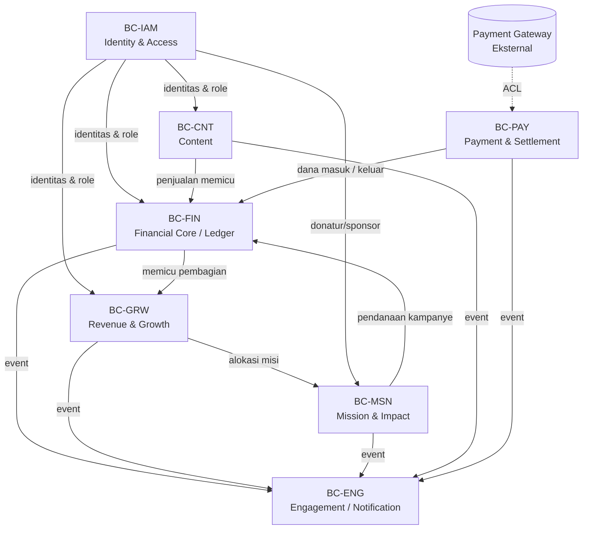
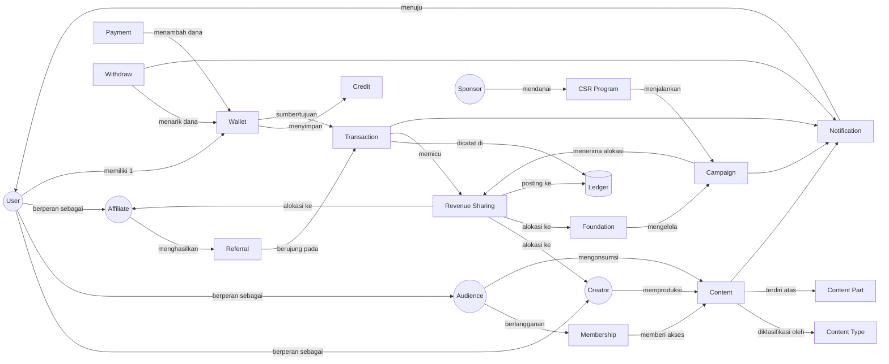
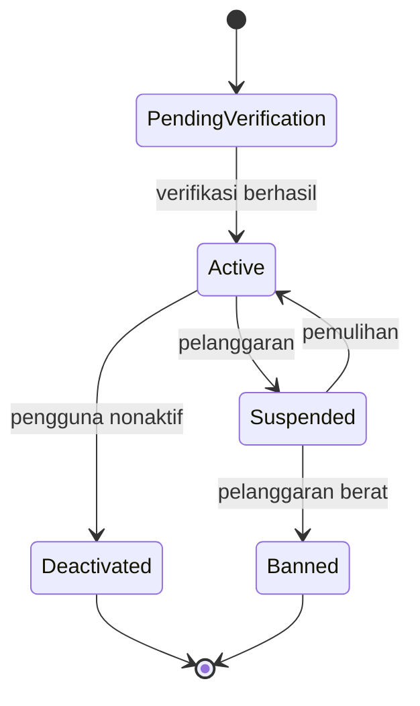
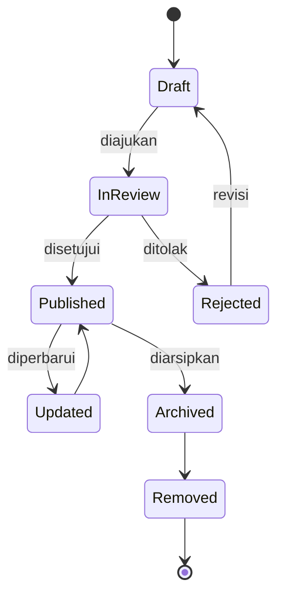
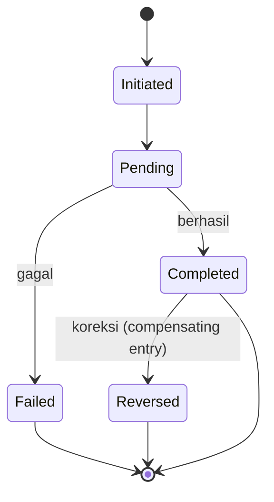
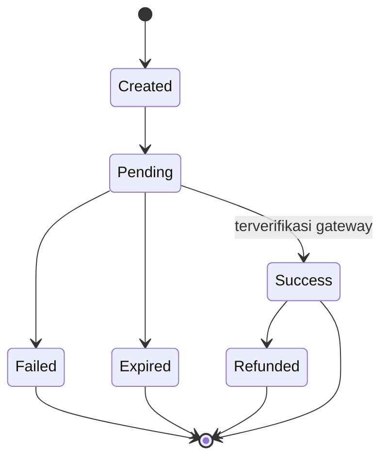
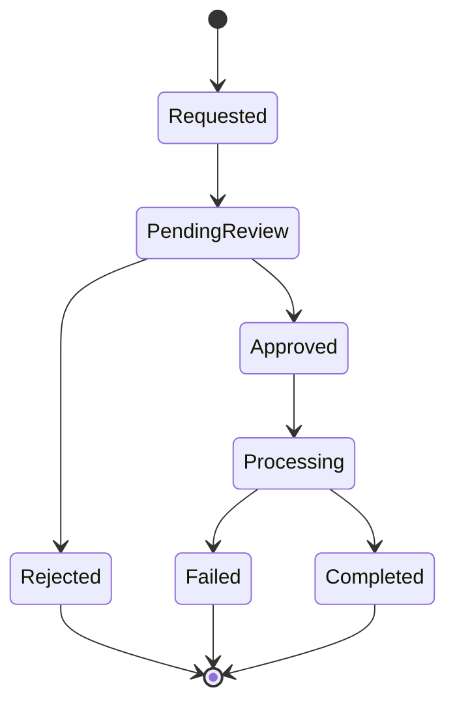
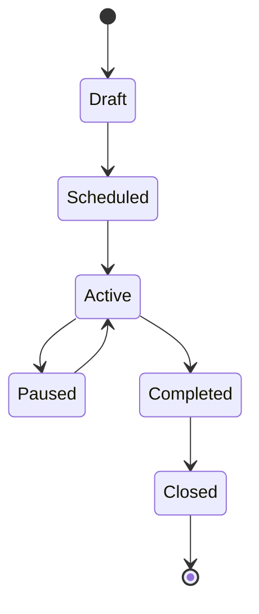
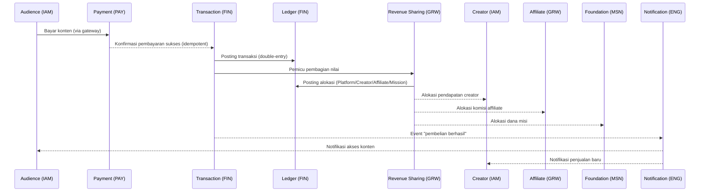

# DAYA PLATFORM — BUSINESS DOMAIN MODEL

> **Fondasi konseptual seluruh sistem DAYA Platform.**
> Dokumen ini mendefinisikan *Business Domain Model* — entity bisnis utama, hubungan, lifecycle, ownership, dan interaksi antar-domain.
> Dokumen ini menjadi acuan langsung bagi **Business Rules (#12)**, **Database Blueprint (#16)**, **API Blueprint (#18)**, dan **System Architecture (#17)**.
> **Dokumen ini TIDAK membahas implementasi database, skema tabel, atau kode.** Fokus murni pada model bisnis.

---

## METADATA DOKUMEN

| Atribut | Nilai |
|---|---|
| Kode Dokumen | `DAYA-01-DOMAIN-MODEL` |
| Versi | `1.0.0` |
| Status | `🟢 Active — Foundational` |
| Tipe | Business Domain Model (DDD — Conceptual Level) |
| Induk | `DAYA-00-PROJECT-CONSTITUTION` · `DAYA-00-MASTER-BLUEPRINT` (Frozen v1.0) |
| Pemilik | Product & Architecture Team |
| Bahasa | Bahasa Indonesia (istilah teknis dalam Bahasa Inggris) |

---

## DAFTAR ISI

1. [Tujuan & Ruang Lingkup](#1-tujuan--ruang-lingkup)
2. [Prinsip Pemodelan Domain](#2-prinsip-pemodelan-domain)
3. [Peta Bounded Context](#3-peta-bounded-context)
4. [Context Map (Mermaid)](#4-context-map-mermaid)
5. [Domain Model Diagram (Mermaid)](#5-domain-model-diagram-mermaid)
6. [Katalog Entity](#6-katalog-entity)
7. [Lifecycle Entity Kunci (Mermaid)](#7-lifecycle-entity-kunci-mermaid)
8. [Aggregate & Ownership](#8-aggregate--ownership)
9. [Interaksi Antar-Domain](#9-interaksi-antar-domain)
10. [Matriks Hak Akses Entity](#10-matriks-hak-akses-entity)
11. [Matriks Ketergantungan Entity](#11-matriks-ketergantungan-entity)
12. [Glossary Singkat](#12-glossary-singkat)

---

## 1. TUJUAN & RUANG LINGKUP

**Tujuan:** Menetapkan satu model bisnis bersama (*shared mental model*) yang menjadi sumber kebenaran konseptual seluruh DAYA Platform, sehingga manusia maupun AI (Claude, ChatGPT, Nexla, TRAE) memiliki pemahaman identik tentang *apa* yang dimodelkan sistem dan *bagaimana* entity saling berhubungan.

**Ruang Lingkup:** 21 entity bisnis utama dan 7 bounded context. Dokumen ini mendefinisikan makna bisnis, bukan struktur penyimpanan. Pemetaan ke tabel/kolom dilakukan pada **Database Blueprint (#16)**.

---

## 2. PRINSIP PEMODELAN DOMAIN

| Prinsip | Penjelasan |
|---|---|
| **Ubiquitous Language** | Istilah pada dokumen ini wajib dipakai konsisten di seluruh kode & dokumen. Tidak boleh ada sinonim tersembunyi. |
| **Entity vs Role** | `User` adalah identitas dasar. `Creator`, `Audience`, dan `Affiliate` adalah **role specialization** dari User, bukan identitas terpisah. Satu User dapat memiliki beberapa role sekaligus. |
| **Aggregate Root** | Setiap kelompok entity memiliki *root* yang menjaga konsistensi (mis. `Wallet` adalah root bagi saldo & `Credit`). Akses ke anggota aggregate hanya melalui root-nya. |
| **Ledger sebagai Single Source of Truth Finansial** | Kebenaran finansial **selalu** berada di `Ledger` (append-only, immutable, double-entry), bukan pada saldo yang dihitung ulang. |
| **Bounded Context** | Domain dipisah menjadi konteks tegas agar perubahan di satu domain tidak merembet liar ke domain lain. |
| **Immutability untuk Fakta Finansial** | `Transaction` dan `Ledger` yang sudah final tidak diubah; koreksi dilakukan dengan entri kompensasi (reversal). |

---

## 3. PETA BOUNDED CONTEXT

DAYA Platform terbagi menjadi **7 Bounded Context**:

| Kode | Bounded Context | Entity di Dalamnya | Sifat |
|---|---|---|---|
| **BC-IAM** | Identity & Access | User, Creator, Audience, Membership | Supporting (inti pendukung) |
| **BC-CNT** | Content | Content Type, Content, Content Part | Core |
| **BC-FIN** | Financial Core (Ledger) | Wallet, Credit, Transaction, Ledger | **Core (jantung sistem)** |
| **BC-PAY** | Payment & Settlement | Payment, Withdraw | Core |
| **BC-GRW** | Revenue & Growth | Revenue Sharing, Affiliate, Referral | Core |
| **BC-MSN** | Mission & Impact | Sponsor, CSR Program, Foundation, Campaign | Core (pembeda misi) |
| **BC-ENG** | Engagement | Notification | Generic Supporting |

> **Catatan:** BC-FIN adalah konteks paling kritikal. Seluruh konteks lain yang menyentuh nilai uang **wajib** tunduk pada **Audit & Ledger Principles (#34)**.

---

## 4. CONTEXT MAP (MERMAID)

Hubungan upstream → downstream antar bounded context. Tanda *ACL* = Anti-Corruption Layer (lapisan penerjemah agar sistem eksternal tidak mencemari model internal).

---

## 5. DOMAIN MODEL DIAGRAM (MERMAID)

Hubungan konseptual antar-entity (bukan skema database).

---

## 6. KATALOG ENTITY

Setiap entity dijelaskan dalam 7 aspek: **Tujuan · Tanggung Jawab · Relasi · Aturan Bisnis Utama · Status/Lifecycle · Hak Akses · Ketergantungan**.

---

### BC-IAM — IDENTITY & ACCESS

#### 6.1 User
- **Tujuan:** Merepresentasikan identitas dasar setiap individu di platform.
- **Tanggung Jawab:** Menyimpan identitas, kredensial, status akun, dan role yang dimiliki.
- **Relasi:** Memiliki satu `Wallet`; dapat berperan sebagai `Creator`, `Audience`, dan/atau `Affiliate`; menerima `Notification`.
- **Aturan Bisnis Utama:** Satu User memiliki tepat satu identitas dan satu Wallet. Satu User boleh memegang beberapa role sekaligus. Email/identitas unik.
- **Status/Lifecycle:** `Pending Verification → Active → Suspended → Deactivated` (dapat `Banned`).
- **Hak Akses:** User mengelola data dirinya sendiri; Admin dapat menangguhkan/mengaktifkan.
- **Ketergantungan:** Menjadi prasyarat seluruh entity lain yang melibatkan kepemilikan.

#### 6.2 Creator
- **Tujuan:** Role User yang memproduksi & memonetisasi `Content`.
- **Tanggung Jawab:** Mengelola karya, menetapkan harga/akses, dan menerima bagian pendapatan.
- **Relasi:** Memproduksi `Content`; menerima alokasi dari `Revenue Sharing`; memiliki tier (Creator Leveling).
- **Aturan Bisnis Utama:** Status Creator diperoleh melalui aplikasi & persetujuan. Hanya Creator aktif yang boleh mempublikasikan Content. Bagian pendapatan mengikuti aturan `Revenue Sharing`.
- **Status/Lifecycle:** `Applied → Pending Review → Approved/Active → Suspended → Revoked`.
- **Hak Akses:** Mengelola Content miliknya; melihat pendapatan & laporan misinya.
- **Ketergantungan:** `User` (identitas), `Content`, `Revenue Sharing`, `Wallet`.

#### 6.3 Audience
- **Tujuan:** Role User yang mengonsumsi konten & menjadi pelanggan.
- **Tanggung Jawab:** Mengakses konten, melakukan pembelian, dan berlangganan `Membership`.
- **Relasi:** Mengonsumsi `Content`; memiliki `Membership`; menjadi sumber `Transaction` pembelian.
- **Aturan Bisnis Utama:** Akses konten berbayar hanya terbuka setelah pembelian/membership yang valid.
- **Status/Lifecycle:** `Registered → Active → Inactive`.
- **Hak Akses:** Mengakses konten yang berhak; mengelola membership & riwayat transaksinya.
- **Ketergantungan:** `User`, `Content`, `Membership`, `Transaction`.

#### 6.4 Membership
- **Tujuan:** Merepresentasikan langganan berkala yang memberi hak akses tertentu.
- **Tanggung Jawab:** Menentukan tingkat akses, masa berlaku, dan status perpanjangan.
- **Relasi:** Dimiliki `Audience`; memberi akses ke `Content`; menghasilkan `Transaction` berulang.
- **Aturan Bisnis Utama:** Akses gugur otomatis saat membership kedaluwarsa/dibatalkan. Perpanjangan menghasilkan transaksi & pencatatan ledger.
- **Status/Lifecycle:** `Active → Renewed → Past Due → Cancelled → Expired`.
- **Hak Akses:** Audience mengelola membershipnya; Admin meninjau & menyesuaikan.
- **Ketergantungan:** `User/Audience`, `Content`, `Transaction`, `Payment`.

---

### BC-CNT — CONTENT

#### 6.5 Content Type
- **Tujuan:** Klasifikasi/taksonomi jenis konten (mis. kursus, artikel, video, e-book).
- **Tanggung Jawab:** Mendefinisikan aturan perilaku & struktur yang berlaku bagi konten dari tipe tersebut.
- **Relasi:** Mengklasifikasi `Content`.
- **Aturan Bisnis Utama:** Setiap Content wajib memiliki satu Content Type. Daftar tipe dikelola Admin (terhubung ke *Configuration Engine* #33).
- **Status/Lifecycle:** `Active → Inactive`.
- **Hak Akses:** Dikelola Admin/Super Admin; dibaca semua role.
- **Ketergantungan:** Mandiri; menjadi acuan bagi `Content`.

#### 6.6 Content
- **Tujuan:** Karya yang diproduksi Creator dan dikonsumsi Audience.
- **Tanggung Jawab:** Menyimpan metadata karya, status publikasi, model akses (gratis/berbayar/membership), dan kepemilikan.
- **Relasi:** Diproduksi `Creator`; berjenis `Content Type`; terdiri atas `Content Part`; dikonsumsi `Audience`; menghasilkan `Transaction` saat dibeli.
- **Aturan Bisnis Utama:** Hanya Content berstatus `Published` yang dapat diakses publik/audience. Perubahan harga tidak berlaku surut pada pembelian yang sudah terjadi.
- **Status/Lifecycle:** `Draft → In Review → Published → (Updated) → Archived/Unpublished → Removed` (dapat `Rejected`).
- **Hak Akses:** Creator pemilik mengelola; Admin memoderasi; Audience mengakses sesuai hak.
- **Ketergantungan:** `Creator`, `Content Type`, `Content Part`.

#### 6.7 Content Part
- **Tujuan:** Sub-unit dari sebuah Content (mis. bab, modul, pelajaran, episode).
- **Tanggung Jawab:** Menyusun konten menjadi bagian-bagian terurut yang dapat dirilis/diakses bertahap.
- **Relasi:** Bagian dari satu `Content`.
- **Aturan Bisnis Utama:** Content Part mewarisi hak akses dari Content induknya. Bagian dapat dirilis bertahap (drip).
- **Status/Lifecycle:** `Draft → Published → Archived` (mengikuti induk).
- **Hak Akses:** Dikelola Creator pemilik induk; diakses sesuai hak induk.
- **Ketergantungan:** `Content` (sebagai aggregate root).

---

### BC-FIN — FINANCIAL CORE (LEDGER)

#### 6.8 Wallet
- **Tujuan:** Wadah nilai (saldo) milik setiap User.
- **Tanggung Jawab:** Menjadi *aggregate root* finansial pengguna; menjadi sumber/tujuan setiap pergerakan nilai.
- **Relasi:** Dimiliki tepat satu `User`; menyimpan `Credit`; terlibat dalam `Transaction`; ditambah `Payment`; ditarik `Withdraw`.
- **Aturan Bisnis Utama:** Saldo **tidak pernah** diubah langsung — perubahan saldo selalu merupakan konsekuensi dari `Transaction` yang terposting di `Ledger`. Saldo tidak boleh negatif kecuali aturan kredit khusus.
- **Status/Lifecycle:** `Active → Frozen → Closed`.
- **Hak Akses:** User membaca saldonya; sistem yang memutasi; Admin dapat membekukan.
- **Ketergantungan:** `User`, `Ledger`, `Transaction`.

#### 6.9 Credit
- **Tujuan:** Unit nilai internal platform (dapat di-top-up & dibelanjakan).
- **Tanggung Jawab:** Merepresentasikan daya beli internal di dalam Wallet.
- **Relasi:** Tersimpan di `Wallet`; bertambah via `Payment`/top-up; berkurang via `Transaction` pembelian.
- **Aturan Bisnis Utama:** Setiap penambahan/pengurangan Credit wajib menghasilkan entri `Ledger`. Credit dapat memiliki masa berlaku (sesuai konfigurasi).
- **Status/Lifecycle:** `Issued → Active → Consumed/Expired`.
- **Hak Akses:** User memakai creditnya; sistem mencatat; Admin meninjau.
- **Ketergantungan:** `Wallet`, `Ledger`, `Payment`.

#### 6.10 Transaction
- **Tujuan:** Merepresentasikan satu peristiwa bisnis yang melibatkan pergerakan nilai.
- **Tanggung Jawab:** Menjadi unit niat bisnis (pembelian, top-up, payout, alokasi) yang kemudian dibukukan ke Ledger.
- **Relasi:** Melibatkan satu/lebih `Wallet`; memicu `Revenue Sharing`; dicatat di `Ledger`; dapat berasal dari `Referral`.
- **Aturan Bisnis Utama:** Transaction bersifat **idempotent** (tidak boleh dobel). Transaction final tidak diubah; koreksi melalui reversal. Setiap Transaction wajib seimbang saat dibukukan.
- **Status/Lifecycle:** `Initiated → Pending → Completed/Settled → Failed` (dapat `Reversed/Refunded`).
- **Hak Akses:** Pemilik melihat transaksinya; sistem yang membuat; Admin mengaudit.
- **Ketergantungan:** `Wallet`, `Ledger`, `Revenue Sharing`, `Payment`.

#### 6.11 Ledger
- **Tujuan:** Buku besar kebenaran finansial platform.
- **Tanggung Jawab:** Mencatat setiap pergerakan nilai secara **double-entry, append-only, dan immutable**.
- **Relasi:** Menerima posting dari `Transaction`, `Revenue Sharing`, `Payment`, `Withdraw`.
- **Aturan Bisnis Utama:** Entri tidak pernah diubah/dihapus. Setiap posting memiliki sisi debit & kredit yang seimbang. Saldo Wallet diturunkan dari Ledger, bukan sebaliknya. (Patuh **Audit & Ledger Principles #34**.)
- **Status/Lifecycle:** `Posted` (final & permanen). Koreksi = entri baru (compensating entry).
- **Hak Akses:** Hanya dibaca (Admin/Audit). Tidak ada hak ubah/hapus bagi siapa pun.
- **Ketergantungan:** Bergantung pada `Transaction` sebagai pemicu; menjadi tumpuan seluruh BC-FIN.

---

### BC-PAY — PAYMENT & SETTLEMENT

#### 6.12 Payment
- **Tujuan:** Merepresentasikan dana masuk dari sumber eksternal (payment gateway).
- **Tanggung Jawab:** Menjembatani pembayaran eksternal menjadi nilai internal (top-up/pembelian).
- **Relasi:** Menambah dana ke `Wallet`/`Transaction`; dipicu oleh `Membership`/pembelian; diverifikasi melalui webhook gateway (via ACL).
- **Aturan Bisnis Utama:** Hanya Payment berstatus sukses (terverifikasi gateway) yang menambah nilai. Penanganan webhook bersifat **idempotent**. Tidak ada kepercayaan buta pada data dari klien.
- **Status/Lifecycle:** `Created → Pending → Paid/Success → Failed → Expired` (dapat `Refunded`).
- **Hak Akses:** User memulai; sistem/gateway memverifikasi; Admin meninjau.
- **Ketergantungan:** `Transaction`, `Wallet`, gateway eksternal (ACL).

#### 6.13 Withdraw
- **Tujuan:** Merepresentasikan penarikan dana keluar ke rekening pengguna.
- **Tanggung Jawab:** Mengelola permintaan, persetujuan, dan pencairan saldo ke luar platform.
- **Relasi:** Menarik dana dari `Wallet`; membukukan ke `Ledger`; umumnya untuk `Creator`/`Affiliate`.
- **Aturan Bisnis Utama:** Withdraw hanya boleh sebesar saldo tersedia. Wajib melalui persetujuan & pemeriksaan fraud. Pencairan menghasilkan entri Ledger.
- **Status/Lifecycle:** `Requested → Pending Review → Approved → Processing → Completed` (dapat `Rejected/Failed`).
- **Hak Akses:** User meminta; Admin menyetujui; sistem mencairkan.
- **Ketergantungan:** `Wallet`, `Ledger`, gateway disbursement (ACL).

---

### BC-GRW — REVENUE & GROWTH

#### 6.14 Revenue Sharing
- **Tujuan:** Mesin pembagian nilai dari sebuah transaksi ke banyak pihak.
- **Tanggung Jawab:** Menghitung & mengalokasikan porsi platform, creator, affiliate, dan misi/foundation, lalu memposting ke Ledger.
- **Relasi:** Dipicu `Transaction`; mengalokasikan ke `Creator`, `Affiliate`, `Foundation`; memposting ke `Ledger`.
- **Aturan Bisnis Utama:** Total alokasi selalu = nilai dasar (tidak ada nilai hilang/tercipta). Urutan pemotongan (waterfall) & pembulatan mengikuti aturan baku. Rasio bersifat configurable (#33).
- **Status/Lifecycle:** `Calculated → Allocated → Posted → Settled`.
- **Hak Akses:** Dijalankan sistem; Admin mengaudit; pihak penerima melihat porsinya.
- **Ketergantungan:** `Transaction`, `Ledger`, `Mission & Foundation Model`, `Affiliate`.

#### 6.15 Affiliate
- **Tujuan:** Role User yang mempromosikan platform/konten untuk memperoleh komisi.
- **Tanggung Jawab:** Menghasilkan tautan/kode referral dan memperoleh komisi atas konversi yang sah.
- **Relasi:** Menghasilkan `Referral`; menerima alokasi dari `Revenue Sharing`.
- **Aturan Bisnis Utama:** Komisi hanya dibayar atas konversi yang valid & lolos pemeriksaan fraud. Self-referral dilarang. Atribusi mengikuti aturan baku.
- **Status/Lifecycle:** `Applied → Active → Suspended → Terminated`.
- **Hak Akses:** Mengelola referralnya & melihat komisinya; Admin memantau penyalahgunaan.
- **Ketergantungan:** `User`, `Referral`, `Revenue Sharing`, `Wallet`.

#### 6.16 Referral
- **Tujuan:** Merekam hubungan/peristiwa rujukan antara Affiliate dan pengguna yang dirujuk.
- **Tanggung Jawab:** Melacak atribusi dari klik/daftar hingga konversi.
- **Relasi:** Dihasilkan `Affiliate`; berujung pada `Transaction` yang memicu komisi.
- **Aturan Bisnis Utama:** Atribusi memiliki masa berlaku (window). Satu konversi diatribusikan sesuai kebijakan (mis. last-click). Referral tidak valid bila terindikasi fraud.
- **Status/Lifecycle:** `Created → Attributed → Qualified → Rewarded` (dapat `Expired/Invalid`).
- **Hak Akses:** Affiliate melihat referralnya; sistem mengatribusikan; Admin mengaudit.
- **Ketergantungan:** `Affiliate`, `Transaction`.

---

### BC-MSN — MISSION & IMPACT

#### 6.17 Sponsor
- **Tujuan:** Pihak eksternal (mis. perusahaan) yang mendanai program sosial.
- **Tanggung Jawab:** Menyediakan pendanaan bagi `CSR Program`/`Campaign`.
- **Relasi:** Mendanai `CSR Program`; terhubung ke `Campaign`.
- **Aturan Bisnis Utama:** Dana sponsor wajib tercatat & dapat diaudit. Penggunaan dana terikat pada program yang disepakati. Transparansi laporan wajib.
- **Status/Lifecycle:** `Prospect → Onboarded/Active → Inactive`.
- **Hak Akses:** Sponsor melihat laporan programnya; Admin/Foundation mengelola.
- **Ketergantungan:** `CSR Program`, `Campaign`, `Foundation`.

#### 6.18 CSR Program
- **Tujuan:** Program tanggung jawab sosial yang didanai sponsor.
- **Tanggung Jawab:** Menaungi satu/lebih `Campaign` dengan tujuan dampak tertentu.
- **Relasi:** Didanai `Sponsor`; menjalankan `Campaign`; dikelola/diawasi `Foundation`.
- **Aturan Bisnis Utama:** Setiap program memiliki tujuan dampak terukur & periode. Dana program tidak boleh dialihkan tanpa persetujuan.
- **Status/Lifecycle:** `Proposed → Approved → Active/Running → Completed → Closed`.
- **Hak Akses:** Foundation/Admin mengelola; Sponsor memantau.
- **Ketergantungan:** `Sponsor`, `Campaign`, `Foundation`.

#### 6.19 Foundation
- **Tujuan:** Entity tata kelola yang mengelola dana misi platform secara transparan.
- **Tanggung Jawab:** Menampung, menyalurkan, dan melaporkan dana misi (dari `Revenue Sharing` & `Sponsor`).
- **Relasi:** Menerima alokasi misi dari `Revenue Sharing`; mengelola `Campaign` & `CSR Program`.
- **Aturan Bisnis Utama:** Seluruh dana misi tercatat di Ledger & dilaporkan publik (*transparency*). Penyaluran dana mengikuti tata kelola foundation. (Mengacu **Mission & Foundation Model #32**.)
- **Status/Lifecycle (Dana Misi):** `Allocated → Held → Disbursed → Reported`.
- **Hak Akses:** Foundation Stakeholder & Admin mengelola; publik melihat laporan dampak.
- **Ketergantungan:** `Revenue Sharing`, `Campaign`, `Ledger`, `Sponsor`.

#### 6.20 Campaign
- **Tujuan:** Inisiatif terikat waktu untuk tujuan misi, penggalangan, atau promosi.
- **Tanggung Jawab:** Mengumpulkan/menyalurkan dukungan menuju tujuan tertentu dalam periode tertentu.
- **Relasi:** Dikelola `Foundation`; dijalankan di bawah `CSR Program`; menerima alokasi dari `Revenue Sharing`/`Sponsor`.
- **Aturan Bisnis Utama:** Campaign memiliki target & periode. Dana yang masuk terikat pada tujuan campaign. Pelaporan progres & hasil wajib.
- **Status/Lifecycle:** `Draft → Scheduled → Active → Paused → Completed → Closed/Archived`.
- **Hak Akses:** Foundation/Admin mengelola; publik/audience dapat mendukung & memantau.
- **Ketergantungan:** `Foundation`, `CSR Program`, `Revenue Sharing`, `Sponsor`.

---

### BC-ENG — ENGAGEMENT

#### 6.21 Notification
- **Tujuan:** Menyampaikan peristiwa penting kepada User melalui berbagai kanal.
- **Tanggung Jawab:** Membuat, mengantre, dan mengirim pemberitahuan (in-app, email, push/WA).
- **Relasi:** Dipicu oleh peristiwa di `Content`, `Transaction`, `Withdraw`, `Campaign`, dll; ditujukan ke `User`.
- **Aturan Bisnis Utama:** Notifikasi finansial tidak boleh hilang (*at-least-once delivery*). Preferensi kanal dihormati. Template terkelola & dapat dilokalkan.
- **Status/Lifecycle:** `Created → Queued → Sent → Delivered → Read` (dapat `Failed`).
- **Hak Akses:** User menerima & mengatur preferensinya; sistem mengirim; Admin mengelola template.
- **Ketergantungan:** Berlangganan event dari hampir seluruh bounded context.

---

## 7. LIFECYCLE ENTITY KUNCI (MERMAID)

### 7.1 User Lifecycle

### 7.2 Content Lifecycle

### 7.3 Transaction Lifecycle

### 7.4 Payment Lifecycle

### 7.5 Withdraw Lifecycle

### 7.6 Campaign Lifecycle

---

## 8. AGGREGATE & OWNERSHIP

| Aggregate Root | Anggota Aggregate | Pemilik (Owner) | Catatan |
|---|---|---|---|
| **User** | (identitas, role) | Diri sendiri | Root identitas |
| **Wallet** | Credit, saldo | User | Akses nilai hanya via Wallet |
| **Content** | Content Part | Creator | Part diakses via Content |
| **Transaction** | (alokasi internal) | Sistem | Imutabel setelah final |
| **Ledger** | Entri double-entry | Sistem (read-only) | Tidak ada pemilik yang boleh mengubah |
| **Campaign** | (target, progres) | Foundation | Di bawah CSR Program |
| **Membership** | (periode akses) | Audience | Memberi hak akses Content |

> **Prinsip Ownership:** Akses ke anggota aggregate **hanya** melalui root-nya. Contoh: tidak ada operasi langsung ke `Content Part` tanpa melalui `Content`; tidak ada mutasi `Credit` tanpa melalui `Wallet` + `Transaction`.

---

## 9. INTERAKSI ANTAR-DOMAIN

Contoh alur lintas-domain saat **Audience membeli Content via tautan Affiliate**:

Prinsip interaksi:
- Setiap pergerakan nilai **selalu** melewati `Transaction → Ledger`.
- Domain Mission menerima nilai **hanya** melalui `Revenue Sharing` atau `Sponsor` (tidak ada jalur tersembunyi).
- `Notification` adalah konsumen event, **tidak pernah** menjadi sumber kebenaran data.

---

## 10. MATRIKS HAK AKSES ENTITY

Legenda: **C**=Create, **R**=Read, **U**=Update, **D**=Delete/Deactivate, **—**=tidak ada akses, **(own)**=hanya miliknya.

| Entity | Audience | Creator | Affiliate | Sponsor | Foundation | Admin | Super Admin |
|---|:--:|:--:|:--:|:--:|:--:|:--:|:--:|
| User | R/U (own) | R/U (own) | R/U (own) | R/U (own) | R/U (own) | R/U | CRUD |
| Creator | — | R/U (own) | — | — | — | R/U | CRUD |
| Audience | R (own) | — | — | — | — | R/U | CRUD |
| Membership | CRU (own) | — | — | — | — | R/U | CRUD |
| Content Type | R | R | R | — | — | R/U | CRUD |
| Content | R | CRUD (own) | R | — | — | R/U (moderasi) | CRUD |
| Content Part | R | CRUD (own) | — | — | — | R/U | CRUD |
| Wallet | R (own) | R (own) | R (own) | R (own) | R (own) | R | R/Freeze |
| Credit | R (own) | R (own) | R (own) | — | — | R | R |
| Transaction | R (own) | R (own) | R (own) | R (own) | R (own) | R (audit) | R (audit) |
| Ledger | — | — | — | — | R (misi) | R (audit) | R (audit) |
| Revenue Sharing | — | R (own) | R (own) | — | R (misi) | R | R |
| Affiliate | — | — | R/U (own) | — | — | R/U | CRUD |
| Referral | — | — | R (own) | — | — | R | R/U |
| Payment | CR (own) | R (own) | — | — | — | R | R/U |
| Withdraw | — | CR (own) | CR (own) | — | — | R/U (approve) | CRUD |
| Sponsor | — | — | — | R (own) | R/U | R/U | CRUD |
| CSR Program | — | — | — | R (own) | CRUD | R/U | CRUD |
| Foundation | — | — | — | — | R/U | R/U | CRUD |
| Campaign | R | R | — | R (own) | CRUD | R/U | CRUD |
| Notification | R/U (own) | R/U (own) | R/U (own) | R (own) | R (own) | CRU (template) | CRUD |

> Matriks ini bersifat konseptual & menjadi masukan bagi **RBAC Permission Matrix (#5)**. Detail granular per-aksi disusun di dokumen tersebut.

---

## 11. MATRIKS KETERGANTUNGAN ENTITY

| Entity | Bergantung Pada |
|---|---|
| Creator, Audience, Affiliate | User |
| Wallet | User |
| Credit | Wallet, Payment |
| Transaction | Wallet, Ledger |
| Ledger | Transaction (sebagai pemicu) |
| Revenue Sharing | Transaction, Ledger, Mission/Foundation, Affiliate |
| Content | Creator, Content Type, Content Part |
| Content Part | Content |
| Membership | Audience, Content, Transaction |
| Payment | Transaction, Wallet, Gateway (ACL) |
| Withdraw | Wallet, Ledger, Gateway (ACL) |
| Referral | Affiliate, Transaction |
| CSR Program | Sponsor, Foundation |
| Campaign | Foundation, CSR Program, Revenue Sharing |
| Foundation | Revenue Sharing, Sponsor, Ledger |
| Notification | Hampir seluruh bounded context (sebagai event consumer) |

---

## 12. GLOSSARY SINGKAT

> Cuplikan istilah inti. Kamus lengkap berada di dokumen **Glossary / Ubiquitous Language (0.1)**.

| Istilah | Makna Ringkas |
|---|---|
| **Aggregate Root** | Entity utama yang menjaga konsistensi sekelompok entity. |
| **Bounded Context** | Batas konteks tegas di mana sebuah model berlaku. |
| **Double-Entry** | Setiap pencatatan memiliki sisi debit & kredit yang seimbang. |
| **Append-Only / Immutable** | Catatan hanya ditambah, tidak pernah diubah/dihapus. |
| **Idempotent** | Operasi yang diulang menghasilkan efek sama (tidak dobel). |
| **ACL (Anti-Corruption Layer)** | Lapisan penerjemah agar sistem eksternal tidak mencemari model internal. |
| **Revenue Sharing** | Mekanisme pembagian nilai transaksi ke banyak pihak. |
| **Mission Allocation** | Porsi nilai yang dialirkan ke misi/foundation. |

---

## CHANGE LOG

| Versi | Tanggal | Perubahan |
|---|---|---|
| 1.0.0 | — | Penerbitan awal Business Domain Model: 21 entity, 7 bounded context, context map, domain model diagram, lifecycle entity kunci, aggregate/ownership, interaksi antar-domain, matriks hak akses & ketergantungan. |

---

> *Dokumen ini adalah fondasi konseptual. Seluruh Business Rules, Database Blueprint, API, dan Architecture wajib konsisten dengan model ini. Perubahan model domain berdampak luas dan harus melalui Change Management.*

**— Akhir Business Domain Model —**
