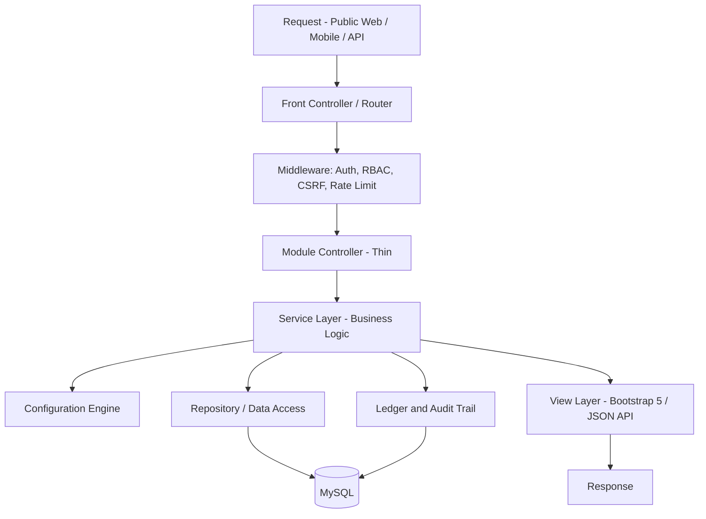
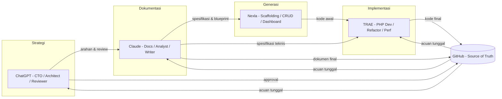
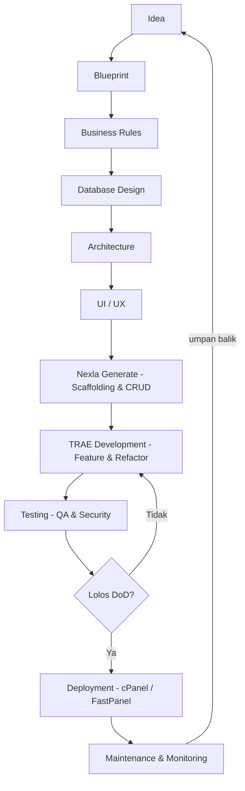
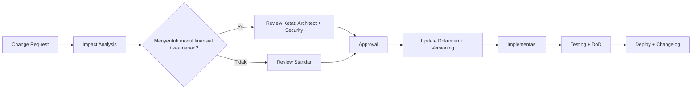
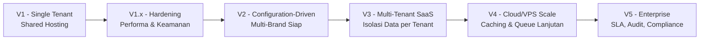

# DAYA PLATFORM — PROJECT CONSTITUTION

> **"Undang-Undang" Proyek DAYA Platform**
> Dokumen ini adalah hukum tertinggi yang mengikat seluruh dokumentasi, pengembangan, dan implementasi DAYA Platform.
> Jika terjadi pertentangan antara dokumen lain dengan Constitution ini, **Constitution yang berlaku**.

---

## METADATA DOKUMEN

| Atribut | Nilai |
|---|---|
| Kode Dokumen | `DAYA-00-PROJECT-CONSTITUTION` |
| Versi | `1.0.0` |
| Status | `🔒 Active — Acuan Resmi Proyek` |
| Tipe | Governing Document (Hukum Tertinggi Proyek) |
| Induk | `DAYA-00-MASTER-BLUEPRINT` (v1.0, Frozen) |
| Pemilik (Owner) | Product & Architecture Team |
| Bahasa | Bahasa Indonesia (istilah teknis dalam Bahasa Inggris) |
| Repositori | GitHub (Source of Truth) |

---

## DAFTAR ISI

1. [Project Identity](#1-project-identity)
2. [Vision Project](#2-vision-project)
3. [Mission Project](#3-mission-project)
4. [Core Values](#4-core-values)
5. [Product Philosophy](#5-product-philosophy)
6. [Architecture Philosophy](#6-architecture-philosophy)
7. [Technical Stack](#7-technical-stack)
8. [Coding Standards](#8-coding-standards)
9. [Documentation Standards](#9-documentation-standards)
10. [AI Collaboration Workflow](#10-ai-collaboration-workflow)
11. [Development Workflow](#11-development-workflow)
12. [Versioning Strategy](#12-versioning-strategy)
13. [Change Management](#13-change-management)
14. [Definition of Done](#14-definition-of-done)
15. [Quality Standards](#15-quality-standards)
16. [Project Principles](#16-project-principles)
17. [Risk Management](#17-risk-management)
18. [Future Evolution](#18-future-evolution)

---

## 1. PROJECT IDENTITY

| Atribut | Keterangan |
|---|---|
| **Nama Proyek** | DAYA Platform |
| **Kategori** | Mission-Driven Creator Economy Platform |
| **Model Produk** | SaaS Enterprise (bertahap dari single-tenant menuju multi-tenant) |
| **Deskripsi** | DAYA Platform adalah platform ekonomi kreator berbasis misi yang menghubungkan creator, audiens, dan affiliate dalam satu ekosistem. Setiap transaksi tidak hanya menghasilkan nilai ekonomi bagi creator, tetapi juga mengalirkan sebagian nilai ke misi sosial melalui *Mission & Foundation Model*. |
| **Tujuan** | Membangun ekosistem digital yang memungkinkan creator memonetisasi karya dan dampak secara berkelanjutan, transparan, dan dapat diaudit, sambil mendukung misi sosial yang terukur. |
| **Ruang Lingkup (V1)** | Manajemen akun & peran, creator economy, content engine, wallet & credit, payment, revenue sharing, affiliate engine, mission allocation, admin panel, analytics, dan notification. Ruang lingkup final mengikuti dokumen **MVP Scope (#29)** dan **Non-Goals V1 (#30)**. |
| **Target Platform** | Web (mobile-first, responsive) + REST API ready untuk konsumsi mobile/eksternal. |
| **Lingkungan Deployment** | Shared Hosting via cPanel / FastPanel. Tanpa Docker, NodeJS, SSH, atau Terminal sebagai prasyarat operasional. |
| **Target Pengguna** | Creator, Member/Audiens, Affiliate, Admin, Super Admin, dan Mission/Foundation Stakeholder. Definisi peran final mengikuti dokumen **User Roles & Permissions (#5)**. |

---

## 2. VISION PROJECT

> **Visi:** Menjadi platform ekonomi kreator berbasis misi yang paling tepercaya di kawasan, tempat setiap karya kreator menciptakan nilai ekonomi sekaligus dampak sosial yang nyata dan dapat diaudit.

Visi jangka panjang DAYA Platform:

1. **Ekonomi yang Adil** — Creator memperoleh bagian nilai yang adil dan transparan dari setiap karya mereka.
2. **Misi yang Terukur** — Setiap rupiah yang mengalir ke misi sosial dapat dilacak, diaudit, dan dilaporkan secara publik.
3. **Skala Enterprise** — Berevolusi dari satu instans menjadi platform SaaS multi-tenant tanpa kehilangan integritas data finansial.
4. **Aksesibilitas** — Dapat dijalankan di infrastruktur terjangkau (shared hosting) sehingga inklusif bagi creator di berbagai tingkat ekonomi.

---

## 3. MISSION PROJECT

DAYA Platform mengemban tiga dimensi misi yang setara:

### 3.1 Misi Bisnis
- Menyediakan kanal monetisasi yang berkelanjutan bagi creator (subscription, penjualan konten, affiliate, dan credit).
- Membangun *unit economics* yang sehat melalui *Revenue Model* dan *Revenue Sharing Engine* yang transparan.
- Menjamin integritas finansial melalui *Audit & Ledger Principles* (double-entry, append-only, immutable).

### 3.2 Misi Sosial
- Mengalirkan sebagian nilai transaksi ke misi sosial melalui *Mission & Foundation Model*.
- Menjamin transparansi alokasi dan dampak melalui pelaporan publik (*Impact Measurement & Reporting*).
- Memberdayakan creator kecil agar memiliki akses setara terhadap alat monetisasi.

### 3.3 Misi Teknologi
- Membangun sistem modular, aman, dan dapat dipelihara menggunakan **PHP Native + MySQL** tanpa ketergantungan pada tooling berat.
- Menyediakan *Configuration Engine* yang membuat aturan bisnis dapat dikonfigurasi tanpa mengubah kode.
- Menjaga kompatibilitas penuh dengan shared hosting sambil menyediakan jalur evolusi ke arsitektur cloud/VPS.

---

## 4. CORE VALUES

| Nilai | Makna dalam Praktik |
|---|---|
| **Mission First** | Setiap keputusan ditimbang dampaknya terhadap misi sosial, bukan hanya metrik kesombongan (*vanity metrics*). |
| **Creator-Centric** | Kepentingan dan keadilan bagi creator diutamakan dalam desain fitur & pembagian nilai. |
| **Financial Integrity** | Tidak ada transaksi tanpa jejak. Setiap pergerakan dana wajib tercatat di ledger dan dapat diaudit. |
| **Transparency** | Alokasi misi, fee, dan komisi terbuka serta dapat diverifikasi. |
| **Simplicity over Complexity** | Solusi paling sederhana yang memenuhi kebutuhan selalu didahulukan. |
| **Security by Design** | Keamanan bukan tambahan akhir, melainkan dipikirkan sejak desain. |
| **Maintainability** | Kode dan dokumen ditulis agar mudah dipahami orang/AI berikutnya. |
| **Inclusivity** | Platform dapat dijangkau dengan infrastruktur terjangkau. |

---

## 5. PRODUCT PHILOSOPHY

Cara berpikir fundamental dalam membangun DAYA Platform:

1. **Mission over Metrics** — Pertumbuhan tanpa dampak misi bukanlah keberhasilan.
2. **Money is Sacred** — Modul finansial diperlakukan dengan kehati-hatian tertinggi; integritas mengalahkan kecepatan.
3. **Configurable, not Hardcoded** — Aturan bisnis yang dapat berubah (fee, komisi, % misi) harus dapat dikonfigurasi melalui *Configuration Engine*.
4. **Build for the Next Reader** — Kode & dokumen ditulis seakan-akan akan dilanjutkan oleh orang (atau AI) yang belum pernah melihatnya.
5. **Constraint as a Feature** — Batasan shared hosting memaksa kesederhanaan, dan kesederhanaan adalah kekuatan.
6. **Trust is Earned by Transparency** — Kepercayaan creator dibangun dengan keterbukaan, bukan janji.
7. **Ship Small, Ship Safe** — Rilis kecil dan terverifikasi lebih baik daripada rilis besar yang berisiko.

> **Trade-off Philosophy:** Bila harus memilih, urutan prioritas adalah **Integritas Finansial → Keamanan → Kejelasan/Maintainability → Performa → Kecepatan Pengiriman Fitur**.

---

## 6. ARCHITECTURE PHILOSOPHY

Prinsip arsitektur sistem DAYA Platform:

1. **Modular Monolith** — Satu basis kode yang terorganisir menjadi modul-modul independen (auth, wallet, content, dll), bukan microservices, demi kesesuaian dengan shared hosting.
2. **Separation of Concerns** — Pemisahan tegas antara routing, business logic, data access, dan presentation.
3. **Thin Controller, Rich Service** — Controller hanya mengatur alur; logika bisnis berada di service layer.
4. **Stateless Request, Stateful Ledger** — Request bersifat stateless; satu-satunya kebenaran finansial adalah ledger di database.
5. **Configuration-Driven** — Perilaku sistem dikendalikan *Configuration Engine*, bukan nilai yang tersebar di kode.
6. **API-Ready by Default** — Setiap modul dirancang agar dapat diekspos melalui REST API tanpa penulisan ulang.
7. **Fail Loud, Recover Safe** — Kesalahan finansial harus gagal terang-terangan dan tidak boleh menghasilkan state setengah jadi (*idempotency*).
8. **Progressive Scalability** — Arsitektur menyiapkan jalur migrasi ke VPS/Cloud tanpa pembongkaran total.



---

## 7. TECHNICAL STACK

| Teknologi | Peran | Alasan Pemilihan |
|---|---|---|
| **PHP Native** | Bahasa utama backend | Kompatibel penuh dengan shared hosting, tanpa ketergantungan build tool; kontrol penuh atas performa & footprint; mudah di-deploy via File Manager. |
| **MySQL** | Database relasional | Standar de-facto di cPanel/FastPanel; mendukung transaksi (InnoDB) yang krusial bagi integritas ledger; matang & terdokumentasi luas. |
| **Bootstrap 5** | UI Framework (CSS) | Responsive & mobile-first bawaan; tanpa proses build (cukup CDN/asset statis); konsisten dengan prinsip kesederhanaan. |
| **JavaScript (Vanilla / Minimal)** | Interaktivitas front-end | Tanpa NodeJS/bundler; memakai JS native untuk interaksi ringan agar tetap kompatibel shared hosting & cepat di perangkat mobile. |
| **Shared Hosting** | Lingkungan produksi awal | Terjangkau & inklusif; memaksa arsitektur sederhana & efisien; menurunkan barrier operasional. |
| **FastPanel / cPanel** | Control panel deployment | Menyediakan File Manager, MySQL, cron, dan SSL tanpa SSH/terminal; sesuai constraint operasional proyek. |
| **GitHub** | Version control & Source of Truth | Pusat kebenaran kode & dokumen; mendukung versioning, review, dan kolaborasi lintas AI/developer. |

> **Catatan Constraint Resmi:** Dilarang menjadikan **Docker, NodeJS, SSH, atau Terminal** sebagai prasyarat operasional. Tooling tersebut hanya boleh dipakai opsional di lingkungan pengembangan lokal, tidak pernah menjadi syarat deployment produksi.

---

## 8. CODING STANDARDS

### 8.1 Naming Convention

| Elemen | Konvensi | Contoh |
|---|---|---|
| Class | `PascalCase` | `WalletService`, `RevenueSplitter` |
| File Class | Sama dengan nama class | `WalletService.php` |
| Method / Function | `camelCase` | `calculateSplit()`, `getUserById()` |
| Variabel | `camelCase` | `$totalAmount`, `$creatorShare` |
| Konstanta | `UPPER_SNAKE_CASE` | `MISSION_DEFAULT_RATE` |
| Tabel Database | `snake_case` (jamak) | `wallet_transactions`, `creators` |
| Kolom Database | `snake_case` | `created_at`, `mission_amount` |
| Primary Key | `id` | `id` |
| Foreign Key | `<entitas>_id` | `creator_id`, `wallet_id` |
| File View/Config | `snake_case` | `dashboard_view.php`, `app_config.php` |
| Route/URL | `kebab-case` | `/creator-dashboard`, `/mission-report` |

### 8.2 Folder Structure (Acuan Awal)

> Kode aplikasi diletakkan **di luar** web root bila hosting mengizinkan; hanya `public/` yang terekspos publik. Struktur final mengikuti dokumen **System Architecture (#17)**.

```
daya-platform/
├── public/                     # Web root (satu-satunya yang terekspos)
│   ├── index.php               # Front controller
│   ├── .htaccess               # Routing & security
│   └── assets/                 # css, js, img (Bootstrap 5, vanilla JS)
├── app/
│   ├── config/                 # Konfigurasi & bootstrap
│   ├── core/                   # Router, Request, Response, Container
│   ├── middleware/             # Auth, RBAC, CSRF, RateLimit
│   ├── modules/                # Modul independen
│   │   ├── auth/
│   │   │   ├── controllers/
│   │   │   ├── services/
│   │   │   ├── models/
│   │   │   └── views/
│   │   ├── wallet/
│   │   ├── content/
│   │   ├── revenue/
│   │   └── mission/
│   └── helpers/                # Fungsi utilitas reusable
├── storage/                    # Di luar web root
│   ├── logs/
│   ├── uploads/
│   └── cache/
├── database/
│   ├── migrations/
│   └── seeds/
├── docs/                       # Seluruh dokumentasi (DAYA-XX-*.md)
└── README.md
```

### 8.3 Security
- Validasi & sanitasi **seluruh** input pengguna (server-side wajib, client-side pelengkap).
- Gunakan **prepared statements** (PDO) untuk setiap kueri — dilarang konkatenasi string SQL.
- Terapkan **CSRF token** pada semua form yang mengubah state.
- Hash password dengan `password_hash()` (algoritma kuat, mis. bcrypt/argon2).
- Terapkan prinsip *least privilege* pada RBAC dan kredensial database.
- Rahasia (API key, kredensial) **tidak pernah** masuk repositori; gunakan file konfigurasi di luar web root.

### 8.4 Reusable Code
- Logika yang dipakai >1 kali wajib diangkat menjadi helper/service.
- Dilarang menyalin-tempel blok logika bisnis (*DRY — Don't Repeat Yourself*).
- Komponen UI berulang dibuat sebagai partial view.

### 8.5 Clean Code
- Satu fungsi melakukan satu hal (*Single Responsibility*).
- Nama variabel/fungsi menjelaskan maksud tanpa perlu komentar.
- Hindari *magic number* — gunakan konstanta atau konfigurasi.
- Komentar menjelaskan **mengapa**, bukan **apa**.
- Batasi panjang fungsi; pecah bila terlalu kompleks.

### 8.6 Modular Programming
- Setiap modul bersifat self-contained dengan batas tegas.
- Komunikasi antar modul melalui service/interface, bukan akses langsung ke internal modul lain.
- Modul finansial (wallet, revenue, payment) patuh penuh pada **Audit & Ledger Principles (#34)**.

---

## 9. DOCUMENTATION STANDARDS

### 9.1 Penamaan File
```
DAYA-[NN]-[KODE-SECTION]-[nama-dokumen].md

Contoh:
DAYA-00-PROJECT-CONSTITUTION.md
DAYA-09-WALLET-ledger-model.md
DAYA-16-DB-entity-relationship-diagram.md
```

### 9.2 Penomoran Dokumen
- `NN` = nomor katalog bagian sesuai **Master Blueprint** (kolom `#`).
- `KODE-SECTION` = kode singkat resmi (mis. `WALLET`, `RBAC`, `MISSION`).
- Dokumen lintas-bagian memakai kode `00` (mis. Constitution).

### 9.3 Format Markdown
- Wajib memakai heading berjenjang yang rapi (`#`, `##`, `###`).
- Gunakan **tabel** untuk data terstruktur, **checklist** untuk kriteria, dan **diagram (ASCII/Mermaid)** bila membantu.
- Setiap dokumen diawali blok **Metadata** (kode, versi, status, owner).
- Bahasa: Indonesia profesional, istilah teknis tetap Inggris.

### 9.4 Versioning (Dokumen)
- Setiap dokumen memiliki nomor versi sendiri (`Major.Minor`).
- Perubahan substansial → naikkan Major; penyempurnaan kecil → naikkan Minor.
- Dokumen yang menjadi acuan resmi diberi status `Frozen` dan hanya diubah lewat *Change Management*.

### 9.5 Changelog
- Setiap dokumen menyertakan tabel **Change Log** (versi, tanggal, perubahan).
- Perubahan tidak boleh menghapus jejak versi sebelumnya.

---

## 10. AI COLLABORATION WORKFLOW

DAYA Platform dikembangkan oleh tim hibrida manusia + AI. Setiap AI memiliki peran resmi:

| AI / Tool | Peran Resmi | Tanggung Jawab Utama |
|---|---|---|
| **ChatGPT** | CTO · Product Architect · Business Architect · Reviewer | Keputusan strategi produk & bisnis, arsitektur tingkat tinggi, dan review akhir. |
| **Claude** | Documentation Architect · Technical Writer · Software Analyst | Menyusun & menjaga konsistensi dokumentasi, analisis kebutuhan, dan spesifikasi teknis. |
| **Nexla AI** | Rapid Application Generator · CRUD Generator · Dashboard Generator | Menghasilkan scaffolding aplikasi, modul CRUD, dan dashboard secara cepat dari spesifikasi. |
| **TRAE AI** | Senior PHP Developer · Refactoring · Feature Development · Performance Optimization | Implementasi fitur, refactoring, optimasi performa, dan penyempurnaan kode. |
| **GitHub** | Source of Truth · Version Control | Pusat kebenaran kode & dokumen serta kendali versi. |



> **Aturan Kolaborasi:** Tidak ada AI yang boleh menyimpang dari **Master Blueprint** & **Project Constitution**. GitHub adalah satu-satunya sumber kebenaran; bila terjadi perbedaan, versi di GitHub yang berlaku.

---

## 11. DEVELOPMENT WORKFLOW

Alur pengembangan resmi dari ide hingga pemeliharaan:



| Tahap | Penanggung Jawab Utama | Output |
|---|---|---|
| Idea | ChatGPT + Owner | Konsep & justifikasi |
| Blueprint | Claude | Dokumen blueprint bagian terkait |
| Business Rules | Claude | Business Rules Catalog |
| Database Design | Claude (analisis) | ERD & Data Dictionary |
| Architecture | ChatGPT + Claude | Architecture spec & ADR |
| UI/UX | Claude (spesifikasi) | Wireframe & design system |
| Nexla Generate | Nexla | Scaffolding, CRUD, dashboard |
| TRAE Development | TRAE | Kode fitur final |
| Testing | QA | Hasil uji & laporan keamanan |
| Deployment | Owner/DevOps | Rilis di shared hosting |
| Maintenance | Tim | Patch, monitoring, evolusi |

---

## 12. VERSIONING STRATEGY

DAYA Platform memakai **Semantic Versioning**: `MAJOR.MINOR.PATCH`.

| Segmen | Kapan Dinaikkan | Contoh |
|---|---|---|
| **MAJOR** | Perubahan tidak kompatibel mundur (*breaking change*) — mis. perubahan skema ledger, perubahan kontrak API publik. | `1.0.0` → `2.0.0` |
| **MINOR** | Penambahan fitur yang kompatibel mundur. | `1.0.0` → `1.1.0` |
| **PATCH** | Perbaikan bug & penyempurnaan tanpa fitur baru. | `1.0.0` → `1.0.1` |

Aturan tambahan:
- Versi pra-rilis ditandai sufiks: `1.0.0-beta.1`.
- Rilis diberi **Git tag** yang sama dengan nomor versi.
- Setiap rilis wajib memiliki entri **Changelog**.
- Modul finansial yang mengubah perilaku perhitungan **selalu** dihitung minimal sebagai MINOR, dan MAJOR bila mengubah struktur ledger.

---

## 13. CHANGE MANAGEMENT

Setiap perubahan fitur atau aturan bisnis mengikuti alur formal:



Aturan:
- Tidak ada perubahan pada dokumen `Frozen` tanpa *Change Request* tercatat.
- Perubahan pada aturan bisnis wajib memperbarui **Business Rules Catalog (#12)** lebih dulu.
- Perubahan pada perhitungan dana wajib melewati review *Audit & Ledger*.
- Setiap perubahan tercatat di GitHub (commit + PR + changelog).

---

## 14. DEFINITION OF DONE

Sebuah fitur dianggap **selesai** hanya jika seluruh kriteria berikut terpenuhi:

- [ ] Memenuhi seluruh *Acceptance Criteria* pada Functional Requirements.
- [ ] Sesuai dengan Business Rules yang berlaku.
- [ ] Input tervalidasi & tersanitasi (server-side).
- [ ] Mengikuti Coding Standards (naming, modular, clean code).
- [ ] Tidak menimbulkan kerentanan OWASP Top 10 yang diketahui.
- [ ] Modul finansial: setiap transaksi tercatat di ledger & dapat direkonsiliasi.
- [ ] Responsive & teruji pada tampilan mobile (mobile-first).
- [ ] Tidak ada *hardcoded value* untuk parameter yang seharusnya konfigurabel.
- [ ] Dokumentasi terkait diperbarui (termasuk changelog).
- [ ] Lolos testing (fungsional + keamanan dasar).
- [ ] Kode masuk GitHub melalui commit/PR yang jelas.

---

## 15. QUALITY STANDARDS

| Dimensi | Standar Wajib |
|---|---|
| **Security** | Prepared statements, CSRF protection, password hashing, RBAC, least privilege, rahasia di luar repo, mitigasi OWASP Top 10. |
| **Performance** | Halaman utama mobile dapat dimuat cepat pada koneksi standar; kueri terindeks; caching untuk data yang sering dibaca; hindari N+1 query. |
| **Maintainability** | Modular, clean code, penamaan konsisten, dokumentasi mutakhir, tanpa duplikasi logika. |
| **Documentation** | Setiap modul memiliki dokumen acuan; perubahan selalu tercermin di docs & changelog. |
| **Scalability** | Skema & arsitektur menyiapkan jalur multi-tenant dan migrasi ke VPS/Cloud tanpa pembongkaran total. |
| **Reliability** | Operasi finansial bersifat idempotent; kegagalan tidak meninggalkan state setengah jadi. |

---

## 16. PROJECT PRINCIPLES

Minimal 20 prinsip utama yang mengikat seluruh proyek:

1. **Constitution adalah hukum tertinggi** — semua dokumen tunduk padanya.
2. **GitHub adalah Source of Truth** — bila berbeda, versi GitHub yang berlaku.
3. **Mission First** — dampak misi selalu menjadi pertimbangan keputusan.
4. **Financial Integrity di atas segalanya** — tidak ada uang tanpa jejak ledger.
5. **Double-Entry & Append-Only** — ledger tidak pernah diubah, hanya ditambah.
6. **Idempotency wajib** untuk seluruh operasi finansial.
7. **Security by Design**, bukan tambahan akhir.
8. **Configurable, not Hardcoded** untuk parameter bisnis yang dapat berubah.
9. **Mobile First** dalam setiap keputusan UI.
10. **Shared Hosting Compatibility** tidak boleh dikompromikan.
11. **Tanpa Docker/NodeJS/SSH/Terminal** sebagai prasyarat produksi.
12. **Modular Monolith** — modul independen dalam satu basis kode.
13. **Thin Controller, Rich Service** — logika bisnis di service layer.
14. **DRY** — dilarang menduplikasi logika bisnis.
15. **Clean Code** — kode menjelaskan dirinya sendiri.
16. **Single Responsibility** — satu unit, satu tanggung jawab.
17. **Validasi Server-Side Wajib** — client-side hanya pelengkap.
18. **Least Privilege** pada akses & kredensial.
19. **Transparency** — fee, komisi, dan alokasi misi terbuka.
20. **Ship Small, Ship Safe** — rilis kecil & terverifikasi.
21. **Document Before Build** — spesifikasi mendahului implementasi.
22. **Business Rules diperbarui lebih dulu** sebelum perubahan kode bisnis.
23. **Backward Compatibility** dijaga; *breaking change* hanya lewat MAJOR version.
24. **Test Before Deploy** — tidak ada rilis tanpa Definition of Done terpenuhi.
25. **Progressive Scalability** — selalu menyiapkan jalur evolusi tanpa pembongkaran total.

---

## 17. RISK MANAGEMENT

| ID | Risiko | Kategori | Dampak | Kemungkinan | Mitigasi |
|---|---|---|:---:|:---:|---|
| R-01 | Inkonsistensi perhitungan dana (split/komisi) | Teknis/Finansial | Tinggi | Sedang | Double-entry ledger, idempotency, rekonsiliasi terjadwal, review *Audit & Ledger*. |
| R-02 | Kerentanan keamanan (SQLi, XSS, CSRF) | Keamanan | Tinggi | Sedang | Prepared statements, sanitasi input, CSRF token, checklist OWASP Top 10. |
| R-03 | Keterbatasan shared hosting (resource/limit) | Operasional | Sedang | Tinggi | Arsitektur ringan, caching, indexing, *capacity planning*, jalur migrasi VPS. |
| R-04 | Scope creep V1 | Bisnis | Sedang | Tinggi | Penegakan **MVP Scope (#29)** & **Non-Goals (#30)**, Change Management formal. |
| R-05 | Inkonsistensi antar-AI dalam kontribusi | Operasional | Sedang | Sedang | Master Blueprint + Constitution sebagai acuan tunggal, Glossary, review GitHub. |
| R-06 | Kehilangan/korupsi data | Teknis | Tinggi | Rendah | Backup terjadwal, *disaster recovery plan*, integritas transaksional InnoDB. |
| R-07 | Penyalahgunaan affiliate (fraud) | Bisnis/Keamanan | Sedang | Sedang | *Anti-Fraud & Abuse Prevention* pada Affiliate Engine, audit trail. |
| R-08 | Ketergantungan pada payment gateway pihak ketiga | Teknis/Bisnis | Sedang | Sedang | Desain integrasi abstrak, penanganan webhook idempotent, fallback manual. |
| R-09 | Dokumentasi usang | Operasional | Sedang | Sedang | Aturan "update docs sebagai bagian DoD", changelog wajib. |
| R-10 | Ketidakpercayaan publik atas alokasi misi | Bisnis/Sosial | Tinggi | Rendah | Transparansi & pelaporan dampak publik, audit ledger misi. |

---

## 18. FUTURE EVOLUTION

DAYA Platform dirancang untuk berevolusi menjadi **SaaS Enterprise** secara bertahap tanpa pembongkaran total.



| Fase Evolusi | Fokus | Prasyarat dari V1 |
|---|---|---|
| **Single Tenant (V1)** | Membuktikan model bisnis & integritas finansial | Modular monolith, ledger kuat, configuration engine |
| **Multi-Brand (V2)** | Mendukung beberapa brand dalam satu instans | Configuration Engine matang, isolasi konfigurasi |
| **Multi-Tenant SaaS (V3)** | Isolasi data antar tenant | Skema DB yang menyiapkan kolom/tenant scoping |
| **Cloud Scale (V4)** | Lepas dari batasan shared hosting | Abstraksi storage, caching & queue yang portabel |
| **Enterprise (V5)** | SLA, audit, kepatuhan | Audit trail menyeluruh, security architecture matang |

> **Prinsip Evolusi:** Setiap keputusan teknis di V1 wajib mempertimbangkan dampaknya terhadap jalur evolusi ini. Tidak boleh ada keputusan yang menutup pintu menuju multi-tenant atau cloud.

---

## CHANGE LOG

| Versi | Tanggal | Perubahan |
|---|---|---|
| 1.0.0 | — | Penerbitan awal Project Constitution sebagai acuan resmi proyek DAYA Platform, selaras dengan Master Blueprint v1.0 (Frozen). |

---

## PENGESAHAN

| Peran | Status |
|---|---|
| Master Blueprint Induk | 🔒 Frozen v1.0 |
| Project Constitution | 🔒 Active v1.0.0 — Acuan Resmi |
| Berlaku untuk | Seluruh dokumentasi, pengembangan, & implementasi DAYA Platform |

> *Dokumen ini adalah hukum tertinggi proyek. Setiap kontributor — manusia maupun AI — terikat untuk mematuhinya. Perubahan hanya melalui mekanisme Change Management & Versioning.*

**— Akhir Project Constitution —**
