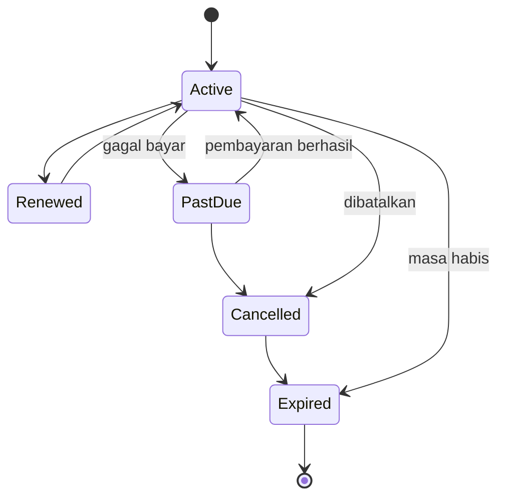

# DAYA PLATFORM — AUDIENCE DOMAIN

> Bounded Context turunan dari **DAYA-01-DOMAIN-MODEL**. Membahas model bisnis domain Audience.
> **Tidak membahas database atau kode.** Fokus murni Business Domain.

## METADATA

| Atribut | Nilai |
|---|---|
| Kode Dokumen | `DAYA-01.02-AUDIENCE-DOMAIN` |
| Versi | `1.0.0` |
| Bounded Context | `BC-IAM` (sub-domain: Audience) |
| Induk | `DAYA-01-DOMAIN-MODEL` |
| Status | `🟢 Active — Foundational` |

---

## 1. TUJUAN DOMAIN
Mengelola pihak yang **mengonsumsi nilai** — audiens/pelanggan — termasuk akses konten, langganan (membership), dan riwayat konsumsi. Domain ini memastikan akses konten selalu sah & sesuai hak.

## 2. TANGGUNG JAWAB
- Pengelolaan profil & preferensi audiens.
- Pengelolaan `Membership` (langganan berkala) dan masa berlakunya.
- Penerbitan & pencabutan **hak akses** (access grant) atas konten.
- Penyimpanan riwayat konsumsi & pustaka (library) audiens.

> Domain ini **tidak** memproses pembayaran (Payment Domain) maupun menyimpan saldo (Wallet Domain).

## 3. ENTITY YANG DIMILIKI
| Entity | Peran |
|---|---|
| **Audience** (root) | Identitas audiens sebagai spesialisasi role dari `User`. |
| **Membership** | Langganan berkala beserta lifecycle-nya. |
| **Access Grant** | Hak akses spesifik atas Content/Content Part. |

## 4. VALUE OBJECT
- **MembershipTier** — tingkat langganan & cakupan akses.
- **SubscriptionPeriod** — periode mulai–berakhir.
- **AccessLevel** — derajat akses (preview/penuh).
- **ConsumptionRecord** — jejak konsumsi (item, waktu).

## 5. AGGREGATE ROOT
Dua aggregate: **Audience** (profil & preferensi) dan **Membership** (lifecycle langganan dengan akses turunannya). Access Grant diatur melalui Membership/pembelian.

## 6. LIFECYCLE
**Audience:** `Registered → Active → Inactive`.
**Membership:**

## 7. BUSINESS EVENT
`AudienceRegistered` · `MembershipSubscribed` · `MembershipRenewed` · `MembershipPaymentFailed` · `MembershipCancelled` · `MembershipExpired` · `ContentAccessGranted` · `ContentAccessRevoked` · `ContentConsumed`.

## 8. BUSINESS RULES UTAMA
- Akses konten berbayar hanya terbuka melalui pembelian sah atau membership aktif.
- Saat membership `Expired`/`Cancelled`, seluruh access grant turunannya gugur otomatis.
- Perpanjangan membership menghasilkan `Transaction` & posting Ledger (via Wallet/Payment Domain).
- Akses bersifat *non-transferable* kecuali aturan gifting di masa depan.

## 9. HAK AKSES
- **Audience:** mengelola profil, membership, & melihat riwayatnya sendiri.
- **Admin:** meninjau & menyesuaikan membership/akses bila perlu.
- **Super Admin:** kontrol penuh.

## 10. INTEGRASI DENGAN DOMAIN LAIN
| Domain | Bentuk Integrasi |
|---|---|
| Content | Audience mengonsumsi Content sesuai hak akses. |
| Payment | Pembelian/perpanjangan membership. |
| Wallet | Pembelian membukukan nilai. |
| Revenue Sharing | Pembelian memicu pembagian nilai. |
| Notification | Pengingat perpanjangan/akses. |
| Analytics | Metrik retensi & konsumsi. |

## 11. DATA OWNERSHIP
Domain ini memiliki: profil audiens, membership, access grant, dan riwayat konsumsi. **Tidak memiliki** kebenaran finansial maupun isi konten.

## 12. FUTURE SCALABILITY
- Paket keluarga/grup & gifting membership.
- Segmentasi audiens & program loyalitas.
- Rekomendasi konten berbasis riwayat konsumsi.
- Membership lintas-creator (bundle) pada model SaaS multi-tenant.

---

## CHANGE LOG
| Versi | Tanggal | Perubahan |
|---|---|---|
| 1.0.0 | — | Penerbitan awal Audience Domain. |

**— Akhir Audience Domain —**
