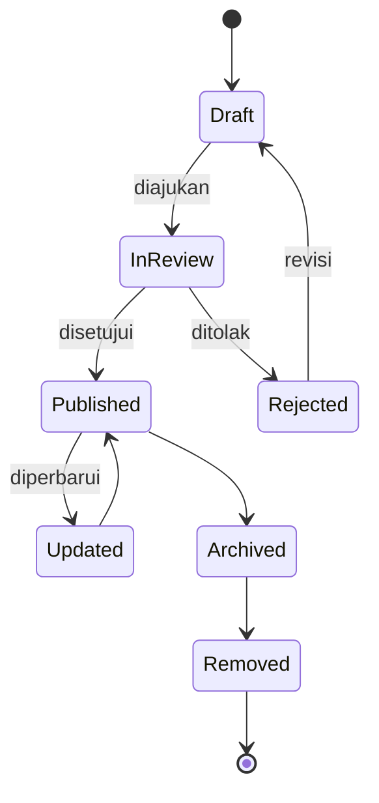

# DAYA PLATFORM — CONTENT DOMAIN

> Bounded Context turunan dari **DAYA-01-DOMAIN-MODEL**. Membahas model bisnis domain Content.
> **Tidak membahas database atau kode.** Fokus murni Business Domain.

## METADATA

| Atribut | Nilai |
|---|---|
| Kode Dokumen | `DAYA-01.03-CONTENT-DOMAIN` |
| Versi | `1.0.0` |
| Bounded Context | `BC-CNT` |
| Induk | `DAYA-01-DOMAIN-MODEL` |
| Status | `🟢 Active — Foundational` |

---

## 1. TUJUAN DOMAIN
Mengelola seluruh siklus hidup karya creator — dari draf hingga arsip — beserta taksonomi dan model aksesnya. Domain ini adalah inti nilai (*core*) yang dijual & dikonsumsi.

## 2. TANGGUNG JAWAB
- Pengelolaan metadata & status publikasi Content.
- Penataan Content ke dalam bagian terurut (`Content Part`).
- Klasifikasi via `Content Type`.
- Penetapan model akses (gratis/berbayar/membership) & harga.
- Penegakan moderasi sebelum publikasi.

> Domain ini mengelola **metadata & aturan akses** karya, bukan penyimpanan file fisik (infrastruktur) maupun pencatatan uang (Wallet).

## 3. ENTITY YANG DIMILIKI
| Entity | Peran |
|---|---|
| **Content** (root) | Karya yang diproduksi creator. |
| **Content Part** | Sub-unit terurut (bab/modul/episode). |
| **Content Type** | Taksonomi jenis konten (reference data). |

## 4. VALUE OBJECT
- **Price** — harga (jumlah + mata uang).
- **AccessPolicy** — gratis / berbayar / membership-only.
- **ContentStatus** — status publikasi.
- **Slug** — pengenal URL SEO-friendly.
- **ReleaseSchedule** — jadwal rilis bertahap (drip).
- **MediaReference** — rujukan ke aset media (bukan file itu sendiri).

## 5. AGGREGATE ROOT
**Content** adalah aggregate root; `Content Part` hanya diakses melaluinya. `Content Type` adalah reference data yang dikelola Administration Domain.

## 6. LIFECYCLE

## 7. BUSINESS EVENT
`ContentCreated` · `ContentSubmitted` · `ContentPublished` · `ContentRejected` · `ContentUpdated` · `ContentPriceChanged` · `ContentPartReleased` · `ContentArchived` · `ContentRemoved`.

## 8. BUSINESS RULES UTAMA
- Setiap Content wajib memiliki tepat satu `Content Type`.
- Hanya Content `Published` yang dapat diakses publik/audience.
- Perubahan harga **tidak berlaku surut** terhadap pembelian yang telah terjadi.
- `Content Part` mewarisi `AccessPolicy` dari Content induknya.
- Publikasi wajib melalui moderasi (Administration Domain).
- `Slug` unik per scope publik.

## 9. HAK AKSES
- **Creator pemilik:** CRUD penuh atas karyanya.
- **Admin:** moderasi (approve/reject), arsip.
- **Audience:** akses baca sesuai hak.
- **Affiliate:** baca metadata untuk promosi.

## 10. INTEGRASI DENGAN DOMAIN LAIN
| Domain | Bentuk Integrasi |
|---|---|
| Creator | Pemilik & produsen Content. |
| Audience | Konsumen Content. |
| Payment/Wallet | Pembelian Content. |
| Revenue Sharing | Penjualan memicu pembagian. |
| Administration | Moderasi & taksonomi. |
| Analytics | Metrik performa konten. |
| Notification | Pemberitahuan rilis/persetujuan. |

## 11. DATA OWNERSHIP
Domain ini memiliki: metadata konten, struktur part, taksonomi tipe, kebijakan akses & harga. **Tidak memiliki** file media fisik (infra) maupun catatan finansial.

## 12. FUTURE SCALABILITY
- Versioning konten & riwayat revisi.
- Kolaborasi multi-creator dalam satu karya.
- Pelabelan/tagging otomatis berbasis AI.
- Lisensi & marketplace konten antar-platform (multi-tenant).

---

## CHANGE LOG
| Versi | Tanggal | Perubahan |
|---|---|---|
| 1.0.0 | — | Penerbitan awal Content Domain. |

**— Akhir Content Domain —**
