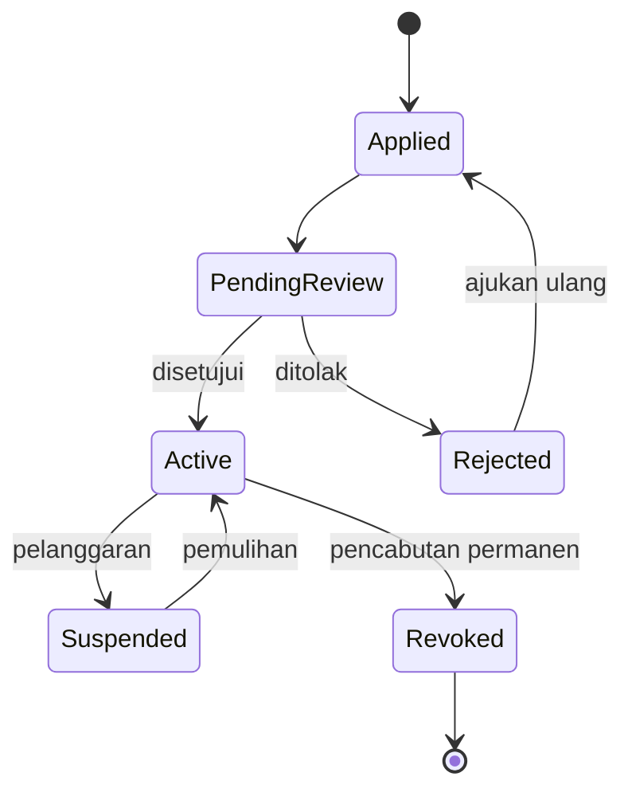

# DAYA PLATFORM — CREATOR DOMAIN

> Bounded Context turunan dari **DAYA-01-DOMAIN-MODEL**. Membahas model bisnis domain Creator.
> **Tidak membahas database atau kode.** Fokus murni Business Domain.

## METADATA

| Atribut | Nilai |
|---|---|
| Kode Dokumen | `DAYA-01.01-CREATOR-DOMAIN` |
| Versi | `1.0.0` |
| Bounded Context | `BC-IAM` (sub-domain: Creator) |
| Induk | `DAYA-01-DOMAIN-MODEL` |
| Status | `🟢 Active — Foundational` |

---

## 1. TUJUAN DOMAIN
Mengelola identitas profesional, kapabilitas, dan hak monetisasi pihak yang **memproduksi nilai** di DAYA Platform. Domain ini memastikan hanya creator yang sah & aktif yang dapat mempublikasikan karya dan menerima pendapatan.

## 2. TANGGUNG JAWAB
- Onboarding & verifikasi creator (aplikasi → persetujuan).
- Pengelolaan profil publik creator (handle, bio, kategori).
- Penetapan & progresi tier (Creator Leveling).
- Pengelolaan *mission score* creator (kontribusi dampak).
- Penghubung antara identitas creator dengan hak monetisasi.

> Domain ini **tidak** menyimpan kebenaran finansial (itu milik Wallet Domain) maupun isi karya (itu milik Content Domain).

## 3. ENTITY YANG DIMILIKI
| Entity | Peran |
|---|---|
| **Creator** (root) | Identitas creator sebagai spesialisasi role dari `User`. |
| **Creator Application** | Permohonan menjadi creator beserta status reviewnya. |
| **Tier Assignment** | Riwayat penetapan tier creator. |

## 4. VALUE OBJECT
- **CreatorTier** — tingkat creator (mis. Starter/Pro/Elite) — *immutable*, ditentukan kriteria.
- **MissionScore** — skor dampak misi creator.
- **CreatorHandle** — pengenal publik unik (slug).
- **PayoutPreference** — preferensi pencairan (bukan saldo).
- **VerificationStatus** — status verifikasi identitas.

## 5. AGGREGATE ROOT
**Creator** adalah aggregate root. Tier Assignment & Creator Application diakses melalui Creator. Konsistensi tier & status dijaga oleh root ini.

## 6. LIFECYCLE

Progresi tier (`Starter → Pro → Elite`) terjadi di dalam status `Active`.

## 7. BUSINESS EVENT
`CreatorApplied` · `CreatorApproved` · `CreatorRejected` · `CreatorSuspended` · `CreatorReinstated` · `CreatorTierUpgraded` · `CreatorMissionScoreUpdated` · `CreatorRevoked`.

## 8. BUSINESS RULES UTAMA
- Satu `User` memiliki maksimal satu profil Creator.
- Hanya Creator berstatus `Active` yang boleh mempublikasikan Content & meminta withdraw.
- Tier ditentukan oleh kriteria terukur (sesuai *Configuration Engine* #33), bukan manual sembarangan.
- Creator `Suspended`/`Revoked` kehilangan hak publikasi & monetisasi, namun riwayat finansialnya tetap utuh di Ledger.
- `CreatorHandle` wajib unik dan tidak dapat diubah sembarangan setelah dipublikasikan.

## 9. HAK AKSES
- **Creator:** mengelola profil & melihat metrik/pendapatannya sendiri.
- **Admin:** meninjau aplikasi, menyetujui/menangguhkan, menyesuaikan tier.
- **Super Admin:** kontrol penuh termasuk pencabutan.
- **Publik/Audience:** membaca profil publik creator yang aktif.

## 10. INTEGRASI DENGAN DOMAIN LAIN
| Domain | Bentuk Integrasi |
|---|---|
| Content | Creator memproduksi Content. |
| Revenue Sharing | Creator menerima alokasi pendapatan. |
| Wallet | Pendapatan creator dibukukan ke Wallet/Ledger. |
| Foundation | Mission score creator memengaruhi narasi dampak. |
| Notification | Event creator memicu notifikasi. |
| Analytics | Metrik performa creator. |
| Administration | Moderasi & persetujuan. |

## 11. DATA OWNERSHIP
Domain ini memiliki: data profil creator, riwayat tier, aplikasi, dan mission score. **Tidak memiliki** saldo/transaksi (Wallet) maupun isi karya (Content).

## 12. FUTURE SCALABILITY
- Akun creator berbasis tim/organisasi (multi-anggota).
- Marketplace creator multi-tier & verifikasi berjenjang.
- Creator API publik untuk integrasi pihak ketiga.
- Multi-tenant: creator yang sama beroperasi pada beberapa brand.

---

## CHANGE LOG
| Versi | Tanggal | Perubahan |
|---|---|---|
| 1.0.0 | — | Penerbitan awal Creator Domain. |

**— Akhir Creator Domain —**
