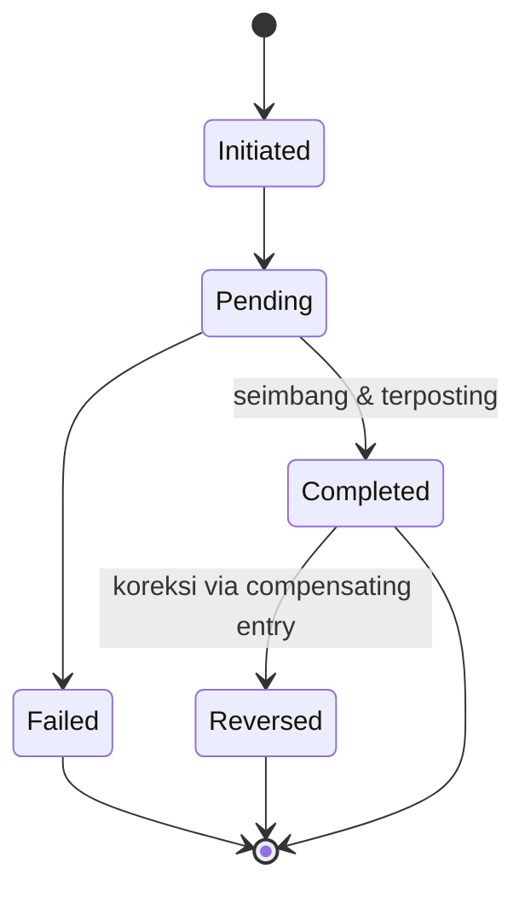

# DAYA PLATFORM — WALLET DOMAIN

> Bounded Context turunan dari **DAYA-01-DOMAIN-MODEL**. Membahas model bisnis domain Wallet (Financial Core).
> **Tidak membahas database atau kode.** Fokus murni Business Domain.

## METADATA

| Atribut | Nilai |
|---|---|
| Kode Dokumen | `DAYA-01.04-WALLET-DOMAIN` |
| Versi | `1.0.0` |
| Bounded Context | `BC-FIN` (Financial Core / Ledger) |
| Induk | `DAYA-01-DOMAIN-MODEL` · **Patuh Audit & Ledger Principles (#34)** |
| Status | `🟢 Active — Foundational (Core / Kritikal)` |

---

## 1. TUJUAN DOMAIN
Menjaga **kebenaran nilai (financial truth)** seluruh platform. Domain ini adalah jantung sistem: setiap pergerakan uang tercatat secara double-entry, append-only, dan immutable, sehingga dapat diaudit kapan pun.

## 2. TANGGUNG JAWAB
- Memelihara `Wallet` dan saldo setiap User.
- Mengelola `Credit` (unit nilai internal).
- Mencatat setiap peristiwa nilai sebagai `Transaction`.
- Membukukan seluruh pergerakan ke `Ledger` (sumber kebenaran).
- Menjamin idempotency & keseimbangan setiap pembukuan.

> Domain ini adalah **satu-satunya** pemilik kebenaran finansial. Domain lain dilarang menyimpan saldo otoritatif.

## 3. ENTITY YANG DIMILIKI
| Entity | Peran |
|---|---|
| **Wallet** (root) | Wadah nilai milik satu User. |
| **Credit** | Unit nilai internal di dalam Wallet. |
| **Transaction** | Peristiwa bisnis bernilai (niat). |
| **Ledger Entry** | Catatan double-entry yang final & permanen. |

## 4. VALUE OBJECT
- **Money** — jumlah + mata uang (*immutable*).
- **Balance** — saldo turunan dari Ledger (bukan angka yang diubah langsung).
- **CreditUnit** — satuan kredit beserta masa berlaku.
- **TransactionType** — jenis (top-up, purchase, payout, allocation, reversal).
- **EntryType** — debit / kredit.

## 5. AGGREGATE ROOT
- **Wallet** — root untuk saldo & Credit.
- **Transaction** — root untuk satu peristiwa nilai dan pembukuannya.
- **Ledger** — penyimpanan append-only; bukan diubah, hanya ditambah.

## 6. LIFECYCLE
**Wallet:** `Active → Frozen → Closed`.
**Transaction:**

**Ledger Entry:** `Posted` (final, tidak pernah berubah).

## 7. BUSINESS EVENT
`WalletCreated` · `WalletCredited` · `WalletDebited` · `WalletFrozen` · `WalletClosed` · `CreditIssued` · `CreditConsumed` · `CreditExpired` · `TransactionInitiated` · `TransactionCompleted` · `TransactionReversed` · `LedgerEntryPosted`.

## 8. BUSINESS RULES UTAMA
- **Double-entry:** setiap pembukuan memiliki sisi debit & kredit yang seimbang.
- **Append-only & immutable:** entri Ledger tidak pernah diubah/dihapus; koreksi = entri kompensasi.
- **Saldo diturunkan dari Ledger**, bukan disimpan sebagai angka yang dimutasi bebas.
- **Idempotency:** satu peristiwa eksternal yang sama tidak menghasilkan transaksi dobel.
- **No negative balance** kecuali aturan kredit khusus yang dikonfigurasi.
- Setiap pergerakan nilai dari domain mana pun **wajib** melewati Transaction → Ledger.

## 9. HAK AKSES
- **User (own):** membaca saldo & riwayat transaksinya.
- **Sistem:** satu-satunya yang memutasi nilai.
- **Admin/Audit:** membaca Ledger untuk audit; dapat membekukan Wallet.
- **Tidak ada peran** yang boleh mengubah/menghapus Ledger.

## 10. INTEGRASI DENGAN DOMAIN LAIN
| Domain | Bentuk Integrasi |
|---|---|
| Payment | Dana masuk → menambah nilai. |
| Payment (Withdraw) | Dana keluar → mengurangi nilai. |
| Revenue Sharing | Posting alokasi multi-pihak. |
| Creator/Audience/Affiliate | Pemilik Wallet. |
| Foundation | Penerimaan dana misi tercatat di Ledger. |
| Analytics | Sumber data finansial (read-only). |
| Administration | Audit & pembekuan. |

## 11. DATA OWNERSHIP
Domain ini adalah **pemilik tunggal** seluruh data finansial: wallet, credit, transaction, dan ledger. Semua domain lain hanya boleh **membaca** turunannya, tidak menyimpan kebenarannya sendiri.

## 12. FUTURE SCALABILITY
- Dukungan multi-currency & nilai tukar.
- Mekanisme escrow/hold (dana ditahan sementara).
- Payout terjadwal & batch.
- Otomasi rekonsiliasi & integrasi sistem akuntansi eksternal.
- Partisi ledger untuk skala besar saat migrasi ke VPS/Cloud.

---

## CHANGE LOG
| Versi | Tanggal | Perubahan |
|---|---|---|
| 1.0.0 | — | Penerbitan awal Wallet Domain (Financial Core). |

**— Akhir Wallet Domain —**
