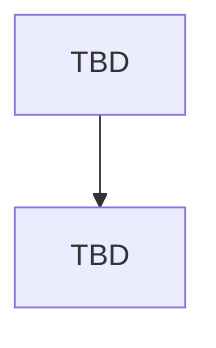

# ADMINISTRATION MODULE — FLOW

> **Status: 🔴 DRAFT (SCAFFOLD)** — Modul ini **belum dirancang**. **JANGAN diimplementasi.** Lengkapi mengikuti `MODULE_TEMPLATE.md` & minta persetujuan terlebih dahulu.

## METADATA
| Atribut | Nilai |
|---|---|
| Modul | Administration |
| Bounded Context | BC-ADM |
| Status | DRAFT |
| Referensi | Blueprint #21 Admin Panel |

---

## DAFTAR FLOW
_(Belum diisi — lengkapi mengikuti MODULE_TEMPLATE.md.)_

## DIAGRAM

## PENANGANAN KEGAGALAN
_(Belum diisi.)_
