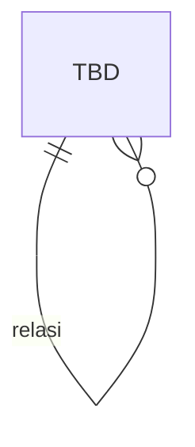

# AUTHENTICATION & IDENTITY MODULE — DATABASE

> **Status: 🔴 DRAFT (SCAFFOLD)** — Modul ini **belum dirancang**. **JANGAN diimplementasi.** Lengkapi mengikuti `MODULE_TEMPLATE.md` & minta persetujuan terlebih dahulu.

## METADATA
| Atribut | Nilai |
|---|---|
| Modul | Authentication & Identity |
| Bounded Context | BC-IAM |
| Status | DRAFT |
| Referensi | DOMAIN_MODEL.md (User, sec. 6.1) ; Blueprint #5 RBAC |

---

## PRINSIP DESAIN DATA
Mengikuti DATABASE_STANDARD. _(Detail belum diisi.)_

## ERD

## DATA DICTIONARY
| Tabel | Kolom | Tipe | Keterangan |
|---|---|---|---|
| _TBD_ | | | _(Belum diisi — lengkapi mengikuti MODULE_TEMPLATE.md.)_ |

## DDL
_(Belum diisi.)_

## INDEXING & INTEGRITAS
_(Belum diisi.)_
