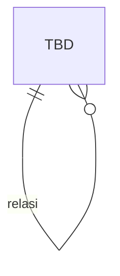

# CONTENT MODULE — DATABASE

> **Status: 🟡 DOMAIN READY** — Domain model tersedia, namun detail implementasi (rules/db/api/ui/dst) **BELUM lengkap**. **Jangan diimplementasi** sebelum dilengkapi mengikuti `MODULE_TEMPLATE.md` & disetujui.

## METADATA
| Atribut | Nilai |
|---|---|
| Modul | Content |
| Bounded Context | BC-CNT |
| Status | DOMAIN_READY |
| Referensi | _domain_reference/CONTENT-DOMAIN.md ; Blueprint #11 |

---

## PRINSIP DESAIN DATA
Mengikuti DATABASE_STANDARD. _(Detail belum diisi.)_

## ERD

## DATA DICTIONARY
| Tabel | Kolom | Tipe | Keterangan |
|---|---|---|---|
| _TBD_ | | | _(Belum diisi — lengkapi mengikuti MODULE_TEMPLATE.md.)_ |

## DDL
_(Belum diisi.)_

## INDEXING & INTEGRITAS
_(Belum diisi.)_
