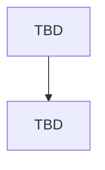

# CREATOR MODULE — FLOW

> **Status: 🟡 DOMAIN READY** — Domain model tersedia, namun detail implementasi (rules/db/api/ui/dst) **BELUM lengkap**. **Jangan diimplementasi** sebelum dilengkapi mengikuti `MODULE_TEMPLATE.md` & disetujui.

## METADATA
| Atribut | Nilai |
|---|---|
| Modul | Creator |
| Bounded Context | BC-IAM |
| Status | DOMAIN_READY |
| Referensi | _domain_reference/CREATOR-DOMAIN.md ; Blueprint #6 |

---

## DAFTAR FLOW
_(Belum diisi — lengkapi mengikuti MODULE_TEMPLATE.md.)_

## DIAGRAM

## PENANGANAN KEGAGALAN
_(Belum diisi.)_
