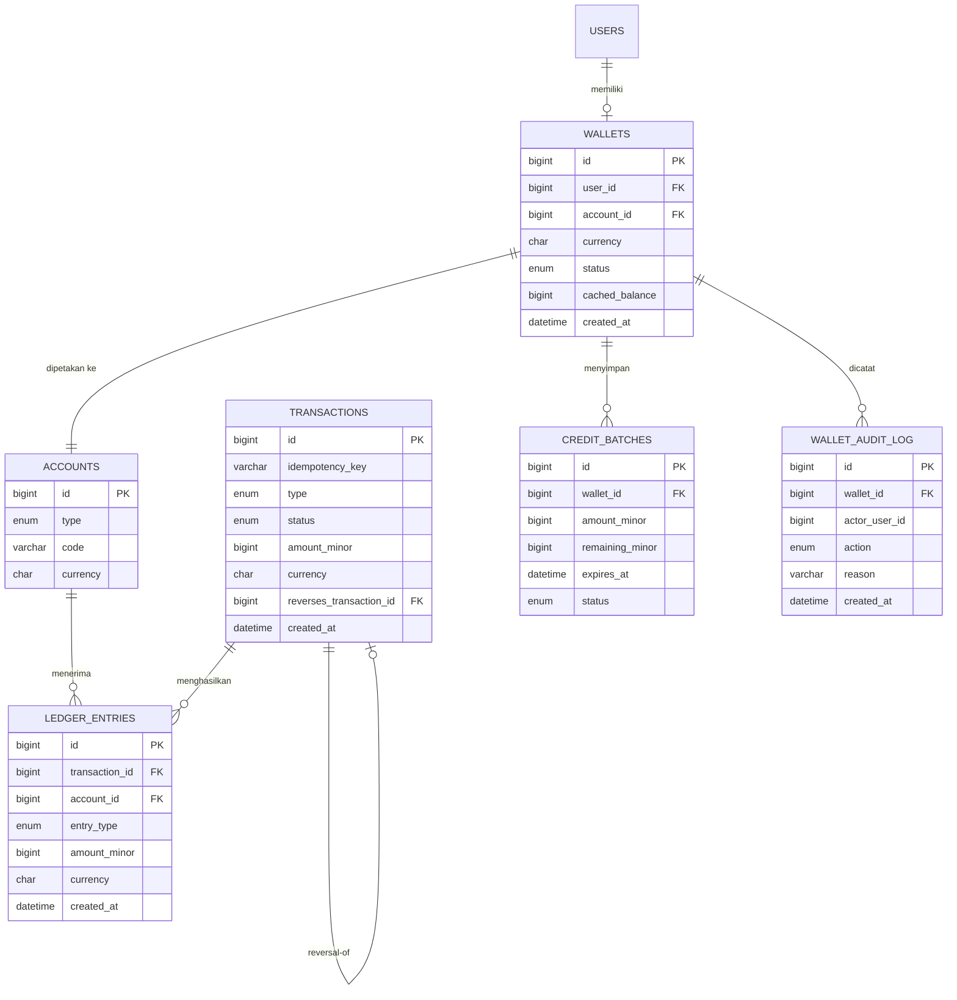

# DAYA PLATFORM — WALLET DATABASE BLUEPRINT

> Modul pilot **Wallet**. Dokumen ini mendefinisikan skema database untuk Financial Core berbasis **double-entry ledger** di MySQL, dioptimalkan untuk **shared hosting**.
> Menerjemahkan **Wallet Domain (`DAYA-01.04`)** & **Wallet Business Rules (`DAYA-09-WALLET-01`)** ke struktur data.
> Berisi *schema/DDL* sebagai artefak desain — **bukan kode aplikasi**.

## METADATA

| Atribut | Nilai |
|---|---|
| Kode Dokumen | `DAYA-09-WALLET-03-DATABASE` |
| Versi | `1.0.0` |
| Modul | Wallet (Pilot) |
| Engine | MySQL (InnoDB) |
| Status | `🟢 Active — Core` |

---

## 1. PRINSIP DESAIN DATA

| Prinsip | Keputusan |
|---|---|
| **Source of Truth** | `ledger_entries` adalah kebenaran finansial. Saldo cache hanya untuk performa. |
| **Double-Entry** | Setiap `transaction` memiliki ≥2 `ledger_entries` yang seimbang (Σ debit = Σ kredit). |
| **Append-Only** | `ledger_entries` & `transactions` tidak pernah di-UPDATE/DELETE; koreksi via reversal. |
| **Representasi Uang** | Disimpan sebagai **integer minor unit** (`BIGINT`, mis. sen) + kolom `currency`, untuk menghindari ambiguitas pembulatan floating point. |
| **Akun Internal** | Pihak non-user (platform, mission, gateway) direpresentasikan sebagai **system account**. |
| **Idempotency** | `transactions.idempotency_key` unik mencegah proses ganda. |
| **InnoDB + FK** | Memakai transaksi DB & foreign key untuk integritas; cocok dengan shared hosting. |

---

## 2. MODEL AKUN (DOUBLE-ENTRY)

Setiap pergerakan nilai dicatat sebagai perpindahan antar **account**. Ada dua jenis akun:

- **User Wallet Account** — satu per Wallet (milik User).
- **System Account** — akun internal platform, mis:
  - `PLATFORM_REVENUE` — pendapatan platform
  - `MISSION_FUND` — dana misi/foundation
  - `GATEWAY_CLEARING` — penampung sementara dana gateway
  - `CREATOR_PAYABLE` / `AFFILIATE_PAYABLE` — kewajiban bayar (opsional)

Contoh pembukuan **Top-up Rp100.000**:

| Account | Debit | Kredit |
|---|---:|---:|
| GATEWAY_CLEARING | 10.000.000 | |
| Wallet User #123 | | 10.000.000 |

(*nilai dalam minor unit / sen*)

---

## 3. ENTITY RELATIONSHIP DIAGRAM



---

## 4. DATA DICTIONARY

### 4.1 `accounts`
| Kolom | Tipe | Keterangan |
|---|---|---|
| id | BIGINT UNSIGNED PK | Identitas akun |
| type | ENUM('user_wallet','system') | Jenis akun |
| code | VARCHAR(64) UNIQUE | Kode akun sistem (mis. `MISSION_FUND`); NULL untuk wallet |
| currency | CHAR(3) | Mata uang (ISO 4217, mis. `IDR`) |
| created_at | DATETIME | Waktu dibuat |

### 4.2 `wallets`
| Kolom | Tipe | Keterangan |
|---|---|---|
| id | BIGINT UNSIGNED PK | Identitas wallet |
| user_id | BIGINT UNSIGNED FK→users.id, UNIQUE | Satu wallet per user (BR-001) |
| account_id | BIGINT UNSIGNED FK→accounts.id, UNIQUE | Akun ledger wallet |
| currency | CHAR(3) | Mata uang wallet |
| status | ENUM('active','frozen','closed') | Status (BR-003/004) |
| cached_balance | BIGINT | Saldo cache (minor unit) — bukan sumber kebenaran |
| created_at | DATETIME | Waktu dibuat |

### 4.3 `transactions`
| Kolom | Tipe | Keterangan |
|---|---|---|
| id | BIGINT UNSIGNED PK | Identitas transaksi |
| idempotency_key | VARCHAR(80) UNIQUE | Pencegah dobel (BR-090) |
| type | ENUM('topup','purchase','allocation','withdraw_hold','withdraw_settle','withdraw_release','credit_expire','reversal') | Jenis transaksi |
| status | ENUM('initiated','pending','completed','failed','reversed') | Status (BR-034) |
| amount_minor | BIGINT | Nilai pokok (minor unit) |
| currency | CHAR(3) | Mata uang |
| reference_type | VARCHAR(40) | Rujukan domain (mis. `content`, `membership`, `payment`) |
| reference_id | BIGINT UNSIGNED | ID rujukan |
| reverses_transaction_id | BIGINT UNSIGNED FK→transactions.id NULL | Untuk reversal (BR-033) |
| created_at | DATETIME | Waktu dibuat |

### 4.4 `ledger_entries` (append-only, immutable)
| Kolom | Tipe | Keterangan |
|---|---|---|
| id | BIGINT UNSIGNED PK | Identitas entri |
| transaction_id | BIGINT UNSIGNED FK→transactions.id | Transaksi induk |
| account_id | BIGINT UNSIGNED FK→accounts.id | Akun terpengaruh |
| entry_type | ENUM('debit','credit') | Sisi pembukuan (BR-042) |
| amount_minor | BIGINT | Nilai (minor unit, selalu positif) |
| currency | CHAR(3) | Mata uang |
| created_at | DATETIME | Waktu posting |

### 4.5 `credit_batches`
| Kolom | Tipe | Keterangan |
|---|---|---|
| id | BIGINT UNSIGNED PK | Identitas batch credit |
| wallet_id | BIGINT UNSIGNED FK→wallets.id | Pemilik |
| amount_minor | BIGINT | Nilai awal |
| remaining_minor | BIGINT | Sisa (FIFO by expiry, BR-022) |
| source | VARCHAR(40) | Sumber (topup/bonus/refund) |
| expires_at | DATETIME NULL | Masa berlaku (BR-021) |
| status | ENUM('active','consumed','expired') | Status |
| created_at | DATETIME | Waktu dibuat |

### 4.6 `wallet_audit_log`
| Kolom | Tipe | Keterangan |
|---|---|---|
| id | BIGINT UNSIGNED PK | Identitas |
| wallet_id | BIGINT UNSIGNED FK→wallets.id | Wallet terkait |
| actor_user_id | BIGINT UNSIGNED | Pelaku tindakan |
| action | ENUM('freeze','unfreeze','close','reconcile_fix') | Jenis tindakan (BR-082) |
| reason | VARCHAR(255) | Alasan wajib |
| created_at | DATETIME | Waktu |

---

## 5. SKEMA DDL (Acuan)

```sql
-- accounts
CREATE TABLE accounts (
  id          BIGINT UNSIGNED NOT NULL AUTO_INCREMENT,
  type        ENUM('user_wallet','system') NOT NULL,
  code        VARCHAR(64) NULL,
  currency    CHAR(3) NOT NULL DEFAULT 'IDR',
  created_at  DATETIME NOT NULL DEFAULT CURRENT_TIMESTAMP,
  PRIMARY KEY (id),
  UNIQUE KEY uq_accounts_code (code)
) ENGINE=InnoDB DEFAULT CHARSET=utf8mb4;

-- wallets
CREATE TABLE wallets (
  id             BIGINT UNSIGNED NOT NULL AUTO_INCREMENT,
  user_id        BIGINT UNSIGNED NOT NULL,
  account_id     BIGINT UNSIGNED NOT NULL,
  currency       CHAR(3) NOT NULL DEFAULT 'IDR',
  status         ENUM('active','frozen','closed') NOT NULL DEFAULT 'active',
  cached_balance BIGINT NOT NULL DEFAULT 0,
  created_at     DATETIME NOT NULL DEFAULT CURRENT_TIMESTAMP,
  PRIMARY KEY (id),
  UNIQUE KEY uq_wallets_user (user_id),
  UNIQUE KEY uq_wallets_account (account_id),
  CONSTRAINT fk_wallets_account FOREIGN KEY (account_id) REFERENCES accounts(id)
) ENGINE=InnoDB DEFAULT CHARSET=utf8mb4;

-- transactions
CREATE TABLE transactions (
  id                       BIGINT UNSIGNED NOT NULL AUTO_INCREMENT,
  idempotency_key          VARCHAR(80) NOT NULL,
  type                     ENUM('topup','purchase','allocation','withdraw_hold',
                                'withdraw_settle','withdraw_release','credit_expire','reversal') NOT NULL,
  status                   ENUM('initiated','pending','completed','failed','reversed') NOT NULL DEFAULT 'initiated',
  amount_minor             BIGINT NOT NULL,
  currency                 CHAR(3) NOT NULL DEFAULT 'IDR',
  reference_type           VARCHAR(40) NULL,
  reference_id             BIGINT UNSIGNED NULL,
  reverses_transaction_id  BIGINT UNSIGNED NULL,
  created_at               DATETIME NOT NULL DEFAULT CURRENT_TIMESTAMP,
  PRIMARY KEY (id),
  UNIQUE KEY uq_tx_idempotency (idempotency_key),
  KEY idx_tx_reference (reference_type, reference_id),
  KEY idx_tx_status_created (status, created_at),
  CONSTRAINT fk_tx_reversal FOREIGN KEY (reverses_transaction_id) REFERENCES transactions(id)
) ENGINE=InnoDB DEFAULT CHARSET=utf8mb4;

-- ledger_entries (append-only)
CREATE TABLE ledger_entries (
  id              BIGINT UNSIGNED NOT NULL AUTO_INCREMENT,
  transaction_id  BIGINT UNSIGNED NOT NULL,
  account_id      BIGINT UNSIGNED NOT NULL,
  entry_type      ENUM('debit','credit') NOT NULL,
  amount_minor    BIGINT NOT NULL,
  currency        CHAR(3) NOT NULL DEFAULT 'IDR',
  created_at      DATETIME NOT NULL DEFAULT CURRENT_TIMESTAMP,
  PRIMARY KEY (id),
  KEY idx_le_tx (transaction_id),
  KEY idx_le_account_created (account_id, created_at),
  CONSTRAINT fk_le_tx FOREIGN KEY (transaction_id) REFERENCES transactions(id),
  CONSTRAINT fk_le_account FOREIGN KEY (account_id) REFERENCES accounts(id),
  CONSTRAINT chk_le_amount CHECK (amount_minor > 0)
) ENGINE=InnoDB DEFAULT CHARSET=utf8mb4;

-- credit_batches
CREATE TABLE credit_batches (
  id               BIGINT UNSIGNED NOT NULL AUTO_INCREMENT,
  wallet_id        BIGINT UNSIGNED NOT NULL,
  amount_minor     BIGINT NOT NULL,
  remaining_minor  BIGINT NOT NULL,
  source           VARCHAR(40) NOT NULL,
  expires_at       DATETIME NULL,
  status           ENUM('active','consumed','expired') NOT NULL DEFAULT 'active',
  created_at       DATETIME NOT NULL DEFAULT CURRENT_TIMESTAMP,
  PRIMARY KEY (id),
  KEY idx_cb_wallet_expiry (wallet_id, expires_at),
  CONSTRAINT fk_cb_wallet FOREIGN KEY (wallet_id) REFERENCES wallets(id)
) ENGINE=InnoDB DEFAULT CHARSET=utf8mb4;

-- wallet_audit_log
CREATE TABLE wallet_audit_log (
  id             BIGINT UNSIGNED NOT NULL AUTO_INCREMENT,
  wallet_id      BIGINT UNSIGNED NOT NULL,
  actor_user_id  BIGINT UNSIGNED NOT NULL,
  action         ENUM('freeze','unfreeze','close','reconcile_fix') NOT NULL,
  reason         VARCHAR(255) NOT NULL,
  created_at     DATETIME NOT NULL DEFAULT CURRENT_TIMESTAMP,
  PRIMARY KEY (id),
  KEY idx_wal_wallet (wallet_id),
  CONSTRAINT fk_wal_wallet FOREIGN KEY (wallet_id) REFERENCES wallets(id)
) ENGINE=InnoDB DEFAULT CHARSET=utf8mb4;
```

> **Catatan:** `CHECK` didukung MySQL 8.0+. Bila hosting memakai MySQL/MariaDB lama, validasi dipindah ke service layer.

---

## 6. STRATEGI INTEGRITAS

| Aspek | Mekanisme |
|---|---|
| Keseimbangan transaksi | Diverifikasi di service layer sebelum commit (Σ debit = Σ kredit). |
| Idempotency | UNIQUE `idempotency_key`; insert duplikat ditolak DB. |
| Append-only Ledger | Hak DB aplikasi **tidak** mencakup UPDATE/DELETE pada `ledger_entries` (least privilege). |
| Konsistensi saldo | Operasi dibungkus transaksi DB (BEGIN/COMMIT) + locking baris wallet. |
| Reversal | Transaksi baru bertipe `reversal` + `reverses_transaction_id`. |
| Saldo cache | `cached_balance` diperbarui dalam transaksi yang sama; direkonsiliasi terjadwal. |

---

## 7. STRATEGI INDEXING

| Tabel | Index | Tujuan |
|---|---|---|
| transactions | `uq_tx_idempotency` | Cegah dobel & lookup cepat |
| transactions | `idx_tx_reference` | Telusur per domain rujukan |
| ledger_entries | `idx_le_account_created` | Hitung saldo & riwayat akun |
| ledger_entries | `idx_le_tx` | Ambil entri per transaksi |
| credit_batches | `idx_cb_wallet_expiry` | Konsumsi FIFO by expiry |

---

## 8. PERTIMBANGAN SHARED HOSTING

- Memakai **InnoDB** untuk dukungan transaksi (krusial bagi integritas finansial).
- Hindari kueri saldo *full scan*: saldo cepat via `cached_balance`, audit via agregasi terindeks.
- Rekonsiliasi & ekspirasi credit dijalankan via **cron cPanel/FastPanel** (bukan daemon).
- Migrasi diterapkan via **File Manager / phpMyAdmin** (tanpa CLI), file SQL bernomor di `database/migrations`.
- Arsip ledger lama disiapkan untuk partisi/tabel arsip saat volume membesar (jalur evolusi).

---

## CHANGE LOG
| Versi | Tanggal | Perubahan |
|---|---|---|
| 1.0.0 | — | Penerbitan awal Wallet Database Blueprint: model double-entry, ERD, data dictionary, DDL, integritas, indexing, & catatan shared hosting. |

**— Akhir Wallet Database Blueprint —**
