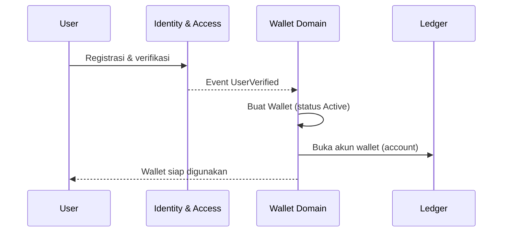
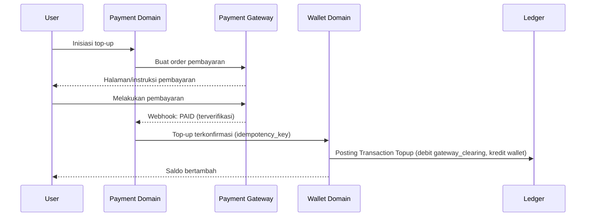
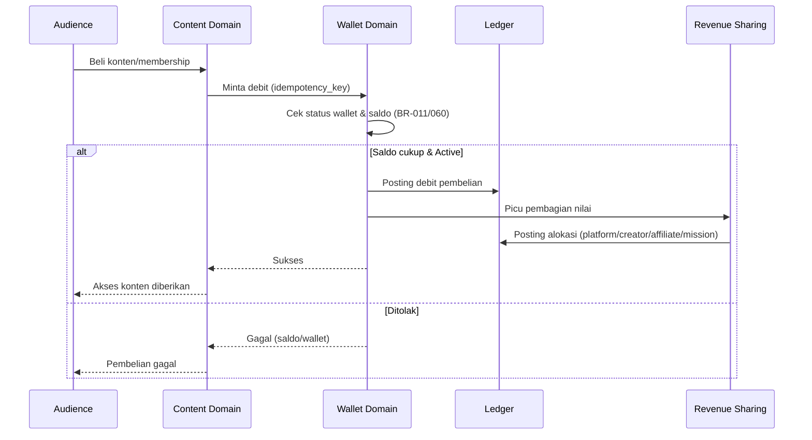
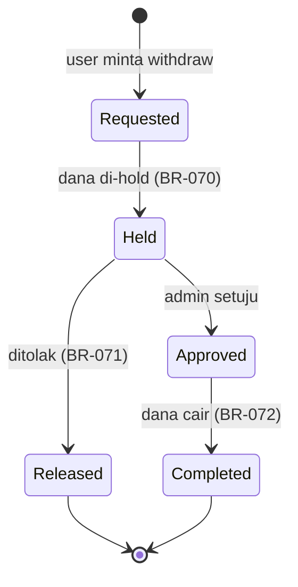
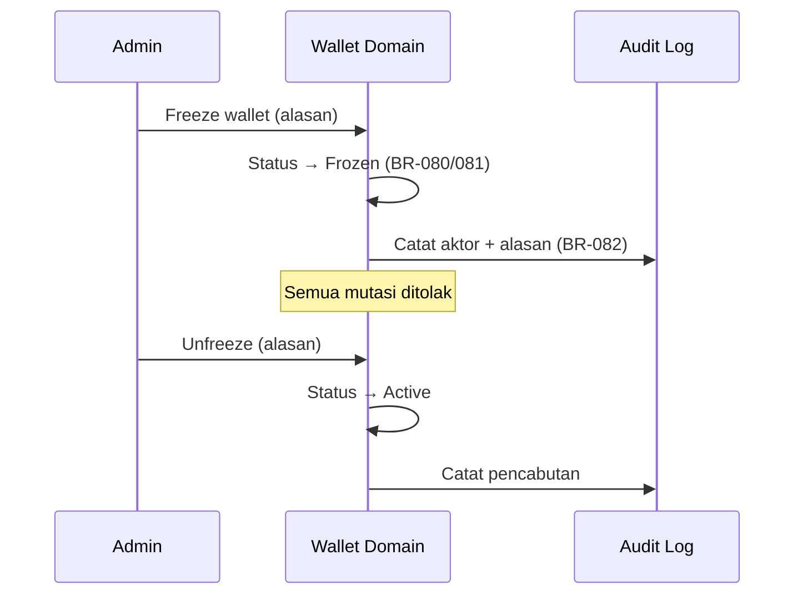
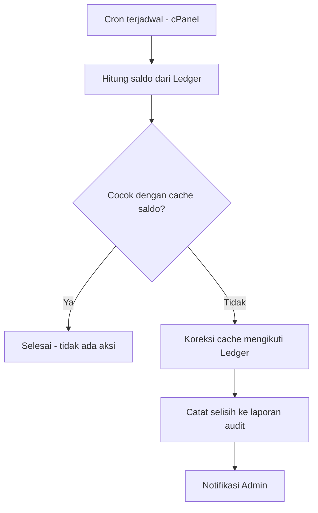

# DAYA PLATFORM — WALLET FLOW

> Modul pilot **Wallet**. Dokumen ini menjabarkan alur proses (business & process flow) operasi Wallet, termasuk penanganan kegagalan & idempotency.
> Mengacu pada **Wallet Business Rules (`DAYA-09-WALLET-01`)**.

## METADATA

| Atribut | Nilai |
|---|---|
| Kode Dokumen | `DAYA-09-WALLET-02-FLOW` |
| Versi | `1.0.0` |
| Modul | Wallet (Pilot) |
| Status | `🟢 Active — Core` |

---

## 1. RINGKASAN ALUR

| Flow | Pemicu | Hasil Akhir |
|---|---|---|
| F1 — Wallet Provisioning | User terverifikasi | Wallet `Active` dibuat |
| F2 — Top-up | Pembayaran sukses | Saldo bertambah |
| F3 — Spend / Purchase | Pembelian | Saldo berkurang + Revenue Sharing |
| F4 — Withdraw (interaksi saldo) | Permintaan withdraw | Dana di-hold → final/dilepas |
| F5 — Freeze / Unfreeze | Indikasi risiko | Mutasi dihentikan/dipulihkan |
| F6 — Reconciliation | Terjadwal (cron) | Cache saldo diselaraskan ke Ledger |

---

## 2. F1 — WALLET PROVISIONING

**Aturan terkait:** BR-WALLET-001.
**Kegagalan:** bila pembuatan akun gagal, seluruh proses di-rollback; Wallet tidak setengah jadi.

---

## 3. F2 — TOP-UP

**Aturan terkait:** BR-WALLET-050, 051, 052, 090.
**Idempotency:** webhook ganda dengan key sama tidak menambah saldo dua kali.
**Kegagalan:** status `FAILED/EXPIRED` dari gateway → tidak ada mutasi nilai.

---

## 4. F3 — SPEND / PURCHASE (dengan Revenue Sharing)

**Aturan terkait:** BR-WALLET-060, 061, 062, 031.
**Catatan:** debit pembelian & alokasi Revenue Sharing terjadi dalam satu transaksi logis yang seimbang (Σ debit = Σ kredit).

---

## 5. F4 — WITHDRAW (Interaksi Saldo)

**Aturan terkait:** BR-WALLET-070, 071, 072.
**Saldo tersedia** = saldo Ledger − dana yang sedang di-hold.
**Detail eksternal** (disbursement gateway) berada di Payment Domain.

---

## 6. F5 — FREEZE / UNFREEZE

**Aturan terkait:** BR-WALLET-080, 081, 082.

---

## 7. F6 — RECONCILIATION (Terjadwal)

**Aturan terkait:** BR-WALLET-100, 101.
**Prinsip:** bila terjadi selisih, **Ledger selalu menang**.

---

## 8. PRINSIP PENANGANAN KEGAGALAN (Lintas Flow)

| Situasi | Penanganan |
|---|---|
| Request ganda (retry) | Idempotency key mencegah proses dobel (BR-090). |
| Kegagalan di tengah posting | Rollback penuh; tidak ada state setengah jadi. |
| Webhook gateway terlambat/ganda | Diproses idempotent; hanya satu yang berlaku. |
| Selisih saldo | Rekonsiliasi mengoreksi ke Ledger & melaporkan. |
| Pending menggantung | TTL menandai `Failed`; saldo tak terpengaruh (BR-034). |

---

## CHANGE LOG
| Versi | Tanggal | Perubahan |
|---|---|---|
| 1.0.0 | — | Penerbitan awal Wallet Flow (F1–F6) + penanganan kegagalan. |

**— Akhir Wallet Flow —**
