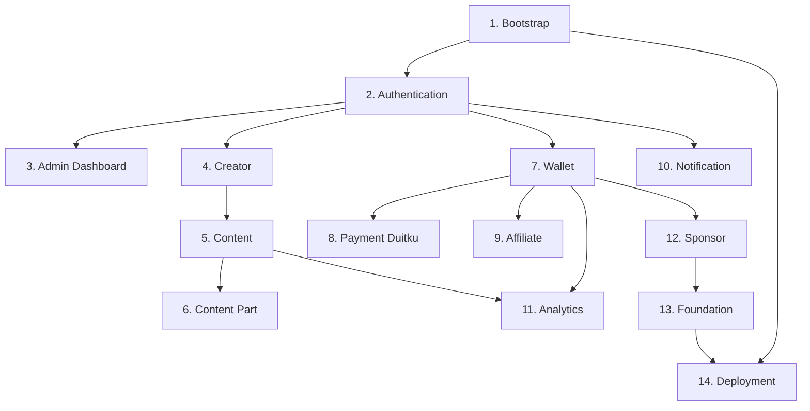

# IMPLEMENTATION SEQUENCE — DAYA PLATFORM (untuk TRAE AI)

> Roadmap implementasi 14 phase. Kerjakan **berurutan**; hormati ketergantungan.

## RINGKASAN PHASE
| Phase | Nama | Prompt | Status Dok. | Bergantung Pada |
|:---:|---|---|:---:|---|
| 1 | Project Bootstrap | `01_PROJECT_BOOTSTRAP.md` | ✅ (standar) | — |
| 2 | Authentication | `02_AUTHENTICATION.md` | 🔴 DRAFT | Phase 1 |
| 3 | Admin Dashboard | `03_ADMIN_DASHBOARD.md` | 🔴 DRAFT | Phase 1,2 |
| 4 | Creator | `04_CREATOR.md` | 🟡 DOMAIN | Phase 2 |
| 5 | Content | `05_CONTENT.md` | 🟡 DOMAIN | Phase 4 |
| 6 | Content Part | `06_CONTENT_PART.md` | 🔴 DRAFT | Phase 5 |
| 7 | Wallet | `07_WALLET.md` | ✅ READY | Phase 2 |
| 8 | Payment (Duitku) | `08_PAYMENT_DUITKU.md` | 🔴 DRAFT | Phase 7 |
| 9 | Affiliate | `09_AFFILIATE.md` | 🔴 DRAFT | Phase 7 |
| 10 | Notification | `10_NOTIFICATION.md` | 🔴 DRAFT | Phase 2 |
| 11 | Analytics | `11_ANALYTICS.md` | 🔴 DRAFT | Phase 7,5 |
| 12 | Sponsor | `12_SPONSOR.md` | 🔴 DRAFT | Phase 7 |
| 13 | Foundation | `13_FOUNDATION.md` | 🔴 DRAFT | Phase 7,12 |
| 14 | Deployment | `14_DEPLOYMENT.md` | ✅ (standar) | Semua |

## PETA KETERGANTUNGAN

## CATATAN URUTAN
- **Authentication (2)** wajib lebih dulu: identitas & RBAC adalah prasyarat semua modul.
- **Wallet (7)** dapat dikerjakan segera setelah Authentication (dokumennya sudah lengkap) dan menjadi **pola acuan** modul lain.
- **Payment/Affiliate/Sponsor/Foundation** menyentuh uang → patuh Audit & Ledger Principles.
- Modul 🔴/🟡 **harus dilengkapi dokumennya** (lihat MODULE_TEMPLATE) sebelum implementasi.
